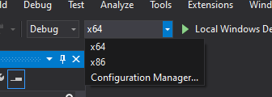
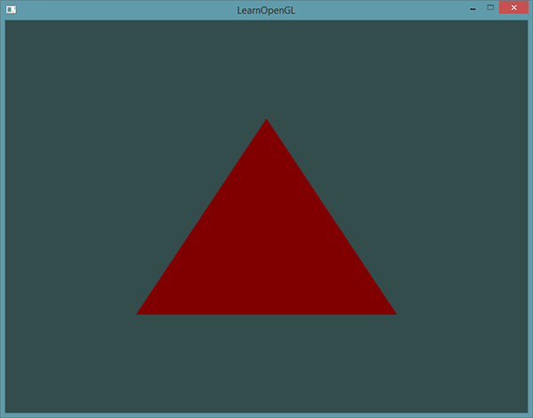
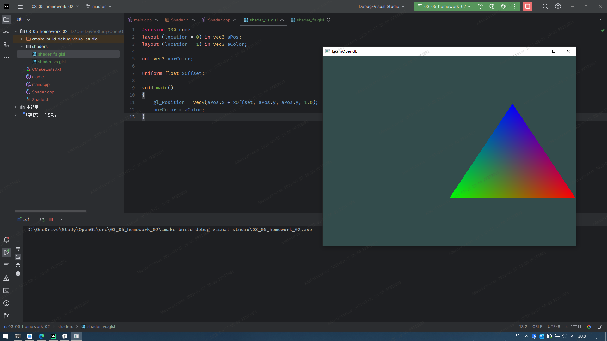
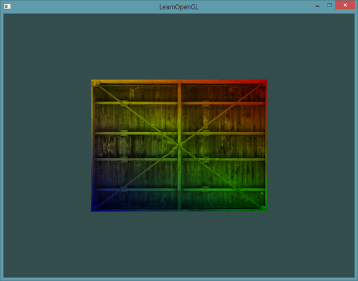
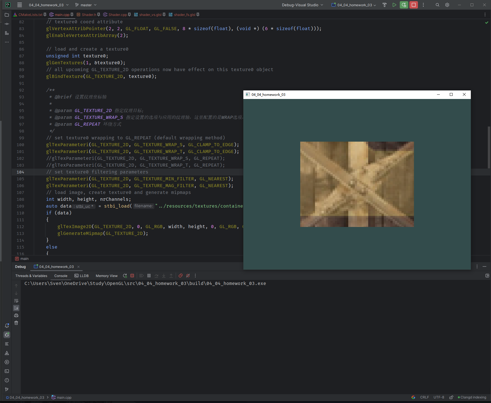
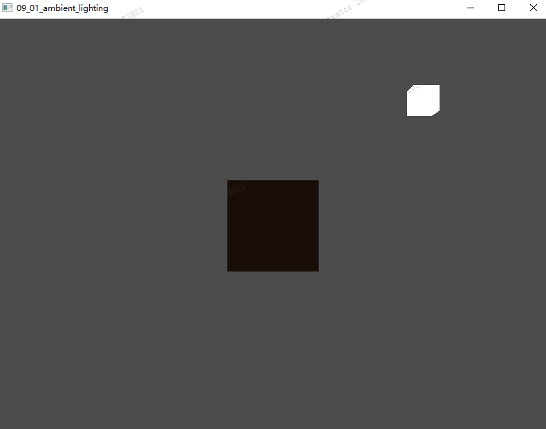

[toc]

# OpenGL

记录OpenGL学习过程，原文地址[LearnOpenGL CN (learnopengl-cn.github.io)](https://learnopengl-cn.github.io/)，感谢中文翻译者们的付出。


# 入门

## 前言

一般OpenGL被认为是一个API(Application Programming Interface, 应用程序编程接口)，包含了一系列可以操作图形、图像的函数。OpenGL本身并不是一个API，它仅仅是一个由[Khronos组织](http://www.khronos.org/)制定并维护的规范(Specification)。

OpenGL规范严格规定了每个函数该如何执行，以及它们的输出值。至于内部具体每个函数是如何实现(Implement)的，将由OpenGL库的开发者自行决定(这里开发者是指编写OpenGL库的人)。因为OpenGL规范并没有规定实现的细节，具体的OpenGL库允许使用不同的实现，只要其功能和结果与规范相匹配(所以作为用户不会感受到功能上的差异)。

实际的OpenGL库的开发者通常是显卡的生产商。所有版本的OpenGL规范文档都被公开的寄存在Khronos那里。本学习是基于OpenGL3.3，地址如下：[规范文档](https://www.opengl.org/registry/doc/glspec33.core.20100311.withchanges.pdf)。

### 核心模式和立即渲染模式

早期的OpenGL使用**立即渲染模式(Immediate mode，也就是固定渲染管线)**，这个模式下绘制图形很方便。OpenGL的大多数功能都被库隐藏起来，开发者很少有控制OpenGL如何进行计算的自由。而开发者迫切希望能有更多的灵活性。随着时间推移，规范越来越灵活，开发者对绘图细节有了更多的掌控。立即渲染模式确实容易使用和理解，但是效率太低。

因此从OpenGL3.2开始，规范文档开始废弃立即渲染模式，并鼓励开发者在OpenGL的**核心模式(Core-profile)**下进行开发，这个分支的规范完全移除了旧的特性。当使用OpenGL的核心模式时，OpenGL迫使我们使用现代的函数。现代函数的优势是更高的灵活性和效率，以往的立即渲染模式从OpenGL实际运作中抽象掉了很多细节，因此它在易于学习的同时，也很难让人去把握OpenGL具体是如何运作的。现代函数要求使用者真正理解OpenGL和图形编程，虽然有一些难度，然而提供了更多的灵活性，更高的效率，更重要的是可以更深入的理解图形编程。

### 扩展

OpenGL的一大特性就是对**扩展(Extension)**的支持，当一个显卡公司提出一个新特性或者渲染上的大优化，通常会以扩展的方式在驱动中实现。如果一个程序在支持这个扩展的显卡上运行，开发者可以使用这个扩展提供的一些更先进更有效的图形功能。通过这种方式，开发者不必等待一个新的OpenGL规范面世，就可以使用这些新的渲染特性了，只需要简单地检查一下显卡是否支持此扩展。通常，当一个扩展非常流行或者非常有用的时候，它将最终成为未来的OpenGL规范的一部分。

使用扩展的代码大多看上去如下：

```c
if(GL_ARB_extension_name)
{
    // 使用硬件支持的全新的现代特性
}
else
{
    // 不支持此扩展: 用旧的方式去做
}
```

### 状态机

OpenGL自身是一个巨大的**状态机(State Machine)**：一系列的变量描述OpenGL此刻应当如何运行。OpenGL的状态通常被称为**OpenGL上下文(Context)**。

通常使用如下途径去更改OpenGL状态：

1. 设置选项
2. 操作缓冲。

之后使用当前OpenGL上下文来渲染。

当使用OpenGL的时候，我们会遇到一些**状态设置函数(State-changing Function)**以及**状态使用函数(State-using Function)**，状态设置函数会改变上下文，状态使用函数会根据当前OpenGL的状态执行一些操作。只要你记住OpenGL本质上是个大状态机，就能更容易理解它的大部分特性。

假设当我们想告诉OpenGL去画线段而不是三角形的时候，我们通过改变一些上下文变量来改变OpenGL状态，从而告诉OpenGL如何去绘图。一旦我们改变了OpenGL的状态为绘制线段，下一个绘制命令就会画出线段而不是三角形。

### 对象

OpenGL库是用**C语言**写的(就是上面说的显卡厂商根据OpenGL根据进行编写的)，同时也支持多种语言的派生，但其内核仍是一个C库。由于C的一些语言结构不易被翻译到其它的高级语言，因此OpenGL开发的时候引入了一些抽象层，**对象(Object)**就是其中一个。

**在OpenGL中一个对象是指一些选项的集合，它代表OpenGL状态的一个子集**。比如，我们可以用一个对象来代表绘图窗口的设置，之后我们就可以设置它的大小、支持的颜色位数等等，可以把对象看做一个C风格的结构体(Struct)：

```c
struct object_name
{
    float  option1;
    int    option2;
    char[] name;
};
```

当我们使用一个对象时，通常看起来像如下一样(把OpenGL上下文看作一个大的结构体)：

```c
// OpenGL的状态
struct OpenGL_Context {
    ...
    object* object_Window_Target;
    ...     
};
```

下面代码展示了使用OpenGL时常见的工作流：

```c
// 创建对象
unsigned int objectId = 0;
glGenObject(1, &objectId);
// 绑定对象至上下文
glBindObject(GL_WINDOW_TARGET, objectId);
// 设置当前绑定到 GL_WINDOW_TARGET 的对象的一些选项
glSetObjectOption(GL_WINDOW_TARGET, GL_OPTION_WINDOW_WIDTH, 800);
glSetObjectOption(GL_WINDOW_TARGET, GL_OPTION_WINDOW_HEIGHT, 600);
// 将上下文对象设回默认
glBindObject(GL_WINDOW_TARGET, 0);
```

1. 创建一个对象，并用一个id保存它的引用(实际数据被储存在后台)；
2. 将对象绑定至上下文的目标位置(上述代码窗口对象目标的位置被定义成GL_WINDOW_TARGET)；
3. 设置窗口的选项；
4. 将目标位置的对象id设回0，解绑这个对象。

**使用对象的好处：**

在OpenGL实际的使用中我们可以定义多个对象，并给这些对象设置不同的选项，这些选项将被保存在objectId所引用的对象中，一旦重新绑定这个对象到GL_WINDOW_TARGET位置，这些选项就会重新生效。在我们执行一个使用OpenGL状态的操作的时候，只需要绑定含有所需设置的对象即可。


## 创建窗口

在使用OpenGL之前，首先要做的就是创建一个**OpenGL上下文(Context)**和一个**用于显示的窗口**。但是OpenGL本身不提供这些内容，这里使用开源库**GLFW**来创建一个窗口和一个OpenGL上下文用来渲染。

### GLFW

GLFW是一个专门针对OpenGL的C语言库，它提供了一些渲染物体所需的最低限度的接口，允许用户创建OpenGL上下文、定义窗口参数以及处理用户输入等功能(可以简单理解为设置OpenGL的上下文环境)。

ps：以下内容还是直接复制，目前我使用的CLion+CMake

#### 构建GLFW

[GLFW下载地址](http://www.glfw.org/download.html)

可以选择通过源代码自己编译或者使用预编译的二进制版本，这里采用手动编译方式：

下载源码包之后，需要里面的这些内容：

- 编译生成的库
- **include**文件夹

之后使用CMake编译，以下内容为直接复制：

CMake是一个工程文件生成工具。用户可以使用预定义好的CMake脚本，根据自己的选择(像是Visual Studio, Code::Blocks, Eclipse)生成不同IDE的工程文件。这允许我们从GLFW源码创建一个Visual Studio 2019工程文件，之后进行编译。首先，我们需要从[这里](http://www.cmake.org/cmake/resources/software.html)下载安装CMake。

当CMake安装成功后，你可以选择从命令行或者GUI启动CMake，由于我们不想让事情变得太过复杂，我们选择用GUI。CMake需要一个源代码目录和一个存放编译结果的目标文件目录。源代码目录我们选择GLFW的源代码的根目录，然后我们新建一个 *build* 文件夹，选中作为目标目录。


在设置完源代码目录和目标目录之后，点击**Configure(设置)**按钮，让CMake读取设置和源代码。我们接下来需要选择工程的生成器，由于我们使用的是Visual Studio 2019，我们选择 **Visual Studio 16** 选项(因为Visual Studio 2019的内部版本号是16)。CMake会显示可选的编译选项用来配置最终生成的库。这里我们使用默认设置，并再次点击**Configure(设置)**按钮保存设置。保存之后，点击**Generate(生成)**按钮，生成的工程文件会在你的**build**文件夹中。

在**build**文件夹里可以找到**GLFW.sln**文件，用Visual Studio 2019打开。因为CMake已经配置好了项目，并按照默认配置将其编译为64位的库，所以我们直接点击**Build Solution(生成解决方案)**按钮，然后在**build/src/Debug**文件夹内就会出现我们编译出的库文件**glfw3.lib**。

库生成完毕之后，我们需要让IDE知道库和头文件的位置。有两种方法：

1. 找到IDE或者编译器的**/lib**和**/include**文件夹，添加GLFW的**include**文件夹里的文件到IDE的**/include**文件夹里去。用类似的方法，将**glfw3.lib**添加到**/lib**文件夹里去。虽然这样能工作，但这不是推荐的方式，因为这样会让你很难去管理库和include文件，而且重新安装IDE或编译器可能会导致这些文件丢失。
2. 推荐的方式是建立一个新的目录包含所有的第三方库文件和头文件，并且在你的IDE或编译器中指定这些文件夹。我个人会使用一个单独的文件夹，里面包含**Libs**和**Include**文件夹，在这里存放OpenGL工程用到的所有第三方库和头文件。这样我的所有第三方库都在同一个位置(并且可以共享至多台电脑)。然而这要求你每次新建一个工程时都需要告诉IDE/编译器在哪能找到这些目录。

完成上面步骤后，我们就可以使用GLFW创建我们的第一个OpenGL工程了！

#### 创建工程


首先，打开Visual Studio，创建一个新的项目。如果VS提供了多个选项，选择Visual C++，然后选择**Empty Project(空项目)**(别忘了给你的项目起一个合适的名字)。由于我们将在64位模式中执行所有操作，而新项目默认是32位的，因此我们需要将Debug旁边顶部的下拉列表从x86更改为x64：



现在我们终于有一个空的工作空间了，开始创建我们第一个OpenGL程序吧！

#### 链接

ps：以下内容还是直接复制，目前我使用的CLion+CMake

为了使我们的程序使用GLFW，我们需要把GLFW库链接(Link)进工程。这可以通过在链接器的设置里指定我们要使用**glfw3.lib**来完成，但是由于我们将第三方库放在另外的目录中，我们的工程还不知道在哪寻找这个文件。于是我们首先需要将我们放第三方库的目录添加进设置。

要添加这些目录(需要VS搜索库和include文件的地方)，我们首先进入Project Properties(工程属性，在解决方案窗口里右键项目)，然后选择**VC++ Directories(VC++ 目录)**选项卡(如下图)。在下面的两栏添加目录：


这里你可以把自己的目录加进去，让工程知道到哪去搜索。你需要手动把目录加在后面，也可以点击需要的位置字符串，选择选项，之后会出现类似下面这幅图的界面，图是选择**Include Directories(包含目录)**时的界面：


这里可以添加任意多个目录，IDE会从这些目录里寻找头文件。所以只要你将GLFW的**Include**文件夹加进路径中，你就可以使用`<GLFW/..>`来引用头文件。库文件夹也是一样的。

现在VS可以找到所需的所有文件了。最后需要在**Linker(链接器)**选项卡里的**Input(输入)**选项卡里添加**glfw3.lib**这个文件：


要链接一个库我们必须告诉链接器它的文件名。库名字是**glfw3.lib**，我们把它加到**Additional Dependencies(附加依赖项)**字段中(手动或者使用选项都可以)。这样GLFW在编译的时候就会被链接进来了。除了GLFW之外，你还需要添加一个链接条目链接到OpenGL的库，但是这个库可能因为系统的不同而有一些差别。

##### Windows上的OpenGL库

如果你是Windows平台，**opengl32.lib**已经包含在Microsoft SDK里了，它在Visual Studio安装的时候就默认安装了。由于这篇教程用的是VS编译器，并且是在Windows操作系统上，我们只需将**opengl32.lib**添加进连接器设置里就行了。值得注意的是，OpenGL库64位版本的文件名仍然是**opengl32.lib**(和32位版本一样)，虽然很奇怪但确实如此。

##### Linux上的OpenGL库

在Linux下你需要链接**libGL.so**库文件，这需要添加`-lGL`到你的链接器设置中。如果找不到这个库你可能需要安装Mesa，NVidia或AMD的开发包，这部分因平台而异(而且我也不熟悉Linux)就不仔细讲解了。

接下来，如果你已经添加GLFW和OpenGL库到连接器设置中，你可以用如下方式添加GLFW头文件：

```
#include <GLFW\glfw3.h>
```

对于用GCC编译的Linux用户建议使用这个命令行选项`-lglfw3 -lGL -lX11 -lpthread -lXrandr -lXi -ldl`。没有正确链接相应的库会产生 *undefined reference* (未定义的引用) 这个错误。

GLFW的安装与配置就到此为止。

### GLAD

ps：以下内容还是直接复制，目前我使用的CLion+CMake

到这里还没有结束，我们仍然还有一件事要做。因为OpenGL只是一个标准/规范，具体的实现是由驱动开发商针对特定显卡实现的。由于OpenGL驱动版本众多，它大多数函数的位置都无法在编译时确定下来，需要在运行时查询。所以任务就落在了开发者身上，开发者需要在运行时获取函数地址并将其保存在一个函数指针中供以后使用。取得地址的方法[因平台而异](https://www.khronos.org/opengl/wiki/Load_OpenGL_Functions)，在Windows上会是类似这样：

```c
// 定义函数原型
typedef void (*GL_GENBUFFERS) (GLsizei, GLuint*);
// 找到正确的函数并赋值给函数指针
GL_GENBUFFERS glGenBuffers  = (GL_GENBUFFERS)wglGetProcAddress("glGenBuffers");
// 现在函数可以被正常调用了
GLuint buffer;
glGenBuffers(1, &buffer);
```

你可以看到代码非常复杂，而且很繁琐，我们需要对每个可能使用的函数都要重复这个过程。幸运的是，有些库能简化此过程，其中**GLAD**是目前最新，也是最流行的库。

#### 配置GLAD

GLAD是一个[开源](https://github.com/Dav1dde/glad)的库，它能解决我们上面提到的那个繁琐的问题。GLAD的配置与大多数的开源库有些许的不同，GLAD使用了一个[在线服务](http://glad.dav1d.de/)。在这里我们能够告诉GLAD需要定义的OpenGL版本，并且根据这个版本加载所有相关的OpenGL函数。

打开GLAD的[在线服务](http://glad.dav1d.de/)，将语言(Language)设置为**C/C++**，在API选项中，选择**3.3**以上的OpenGL(gl)版本(我们的教程中将使用3.3版本，但更新的版本也能用)。之后将模式(Profile)设置为**Core**，并且保证选中了**生成加载器**(Generate a loader)选项。现在可以先(暂时)忽略扩展(Extensions)中的内容。都选择完之后，点击**生成**(Generate)按钮来生成库文件。

GLAD现在应该提供给你了一个zip压缩文件，包含两个头文件目录，和一个**glad.c**文件。将两个头文件目录(**glad**和**KHR**)复制到你的**Include**文件夹中(或者增加一个额外的项目指向这些目录)，并添加**glad.c**文件到你的工程中。

经过前面的这些步骤之后，你就应该可以将以下的指令加到你的文件顶部了：

```c
// 这里需要注意下，需要先写glad.h，再写glfw3.h
#include <glad/glad.h> 
```

点击编译按钮应该不会给你提示任何的错误，到这里我们就已经准备好继续学习[下一节](https://learnopengl-cn.github.io/01 Getting started/03 Hello Window/)去真正使用GLFW和GLAD来设置OpenGL上下文并创建一个窗口了。

## 第一个窗口

现在我们根据配置的环境新建一个cpp文件测试下，**头文件**如下：

```c++
//! 注意：在包含GLFW的头文件之前包含了GLAD的头文件。GLAD的头文件包含了正确的OpenGL头文件(例如GL/gl.h)，所以需要在其它依赖于OpenGL的头文件之前包含GLAD。
#include <glad/glad.h>
#include <GLFW/glfw3.h>
```

**创建main函数：**

```c++
int main()
{
    //! 初始化GLFW
    glfwInit();
    //! 配置GLFW，GLFW_CONTEXT_VERSION_MAJOR代表选项的名称，可以从很多以GLFW_开头的枚举值中选择;第二个参数接受一个整型，用来设置这个选项的值，详细可见GLFW’s window handling这篇文档。
    //! 本次学习是基于OpenGL3.3版本，所以主版本和小版本都为3
    glfwWindowHint(GLFW_CONTEXT_VERSION_MAJOR, 3);
    glfwWindowHint(GLFW_CONTEXT_VERSION_MINOR, 3);
    //! 使用的是核心模式
    glfwWindowHint(GLFW_OPENGL_PROFILE, GLFW_OPENGL_CORE_PROFILE);
    //! 如果使用的是Mac OS X系统，需要在初始化代码中加下面这行
    // glfwWindowHint(GLFW_OPENGL_FORWARD_COMPAT, GL_TRUE);
    return 0;
}
```

创建一个**窗口对象**

```c++
//! 创建一个窗口对象，这个窗口对象存放了所有和窗口相关的数据
GLFWwindow *window = glfwCreateWindow(SCR_WIDTH, SCR_HEIGHT, "hello window", nullptr, nullptr);
if (window == nullptr)
{
    std::cout << "Failed to create GLFW window" << std::endl;
    glfwTerminate();
    return -1;
}
//! 通知GLFW将此窗口的上下文设置为当前线程的主上下文
glfwMakeContextCurrent(window);
```

### GLAD

如前文所述，通过GLAD来管理OpenGL的函数指针

```c++
//! 初始化GLAD，给GLAD传入了用来加载系统相关的OpenGL函数指针地址的函数，这里就是GLFW给我们的glfwGetProcAddress函数
if (!gladLoadGLLoader((GLADloadproc)glfwGetProcAddress))
{
    std::cout << "Failed to initialize GLAD" << std::endl;
    return -1;
}
```

### 视口

1. 开始渲染前需要设置OpenGL渲染窗口的尺寸大小，即视口(Viewport)，之后OpenGL根据设置显示数据和坐标。通过调用glViewport函数来设置窗口的**维度(Dimension)**：

```c++
//! 前两个参数控制窗口左下角的位置。第三个和第四个参数控制渲染窗口的宽度和高度(像素)
glViewport(0, 0, 800, 600);
```

2. 注册以下回调函数，设置GLFW每当窗口调整大小的时候调用：

```c++
glfwSetFramebufferSizeCallback(window, framebuffer_size_callback);
```

3. 完整函数如下：

```c++
void framebuffer_size_callback(GLFWwindow *window, int width, int height)
{
    glViewport(0, 0, width, height);
}

glfwSetFramebufferSizeCallback(window, framebuffer_size_callback);
```

### 渲染循环

添加一个渲染循环，除非用户手动关闭，保证一直处于渲染状态：

```c++
//! 每次循环的开始前检查一次GLFW是否被要求退出
while(!glfwWindowShouldClose(window))
{
    //! 检查有没有触发什么事件(比如键盘输入、鼠标移动等)、更新窗口状态，并调用对应的回调函数(可以通过回调方法手动设置)，就是上面的glfwSetFramebufferSizeCallback()->framebuffer_size_callback()->glViewport()这一套流程
    glfwSwapBuffers(window);
    //! 交换颜色缓冲(它是一个储存着GLFW窗口每一个像素颜色值的大缓冲)，它在这一迭代中被用来绘制，并且将会作为输出显示在屏幕上。
    glfwPollEvents();    
}
```

> **双缓冲(Double Buffer)**
>
> 应用程序使用单缓冲绘图时可能会存在图像闪烁的问题。 这是因为生成的图像不是一下子被绘制出来的，而是按照从左到右，由上而下逐像素地绘制而成的。最终图像不是在瞬间显示给用户，而是通过一步一步生成的，这会导致渲染的结果很不真实。为了规避这些问题，我们应用双缓冲渲染窗口应用程序。**前缓冲**保存着最终输出的图像，它会在屏幕上显示；而所有的的渲染指令都会在**后缓冲**上绘制。当所有的渲染指令执行完毕后，我们**交换(Swap)前缓冲和后缓冲**，这样图像就立即呈显出来，之前提到的不真实感就消除了。

### 释放资源

当渲染循环结束后需要正确释放/删除之前的分配的所有资源。通过可以在`main`函数的最后调用`glfwTerminate`函数来完成：

```c++
glfwTerminate();
return 0;
```

至此第一个窗口的代码已经全部完成，结果如下(就是一个黑框)：


### 输入

通过使用GLFW的几个输入函数可以在GLFW中实现一些输入控制，以下述代码为例：

在渲染循环中调用`processInput`来检测是否有调用`glfwSetWindowShouldClose`(当用户按下ESC时将通过`glfwGetKey`函数实现)将GLFW的`WindowShouldClose`属性设置为`true`，如果有的话就退出渲染循环。

```c++
//! 每次循环的开始前检查一次GLFW是否被要求退出
while (!glfwWindowShouldClose(window))
{
    //! 在渲染循环的每一个迭代中调用processInput
    processInput(window);

    glfwSwapBuffers(window);
    glfwPollEvents();
}
//! 创建一个processInput函数来让所有的输入代码保持整洁
void processInput(GLFWwindow *window)
{
	//! glfwGetKey入参为一个窗口和一个按键，返回这个按键是否正在被按下
    if(glfwGetKey(window, GLFW_KEY_ESCAPE) == GLFW_PRESS)
    {
        //! 把WindowShouldClose属性设置为true的方法关闭GLFW
        glfwSetWindowShouldClose(window, true);
    }
}
```

### 渲染

将想要的渲染操作(Rendering)放在循环迭代中，这样就能保证所有的操作都能得到执行：

```c++
// 渲染循环
while(!glfwWindowShouldClose(window))
{
    // 输入
    processInput(window);

    //! 渲染指令
    //! 设置清除缓冲的颜色
	glClearColor(0.2f, 0.3f, 0.3f, 1.0f);
    //! 清除颜色缓冲，整个颜色缓冲都会被填充为glClearColor里所设置的颜色
	glClear(GL_COLOR_BUFFER_BIT);

    // 检查并调用事件，交换缓冲
    glfwPollEvents();
    glfwSwapBuffers(window);
}
```

上述代码我们使用一个自定义的颜色清空屏幕。在实际的开发中，有可能会需要完全清除上一次的颜色缓冲，通过调用`glClear`函数来清空屏幕的颜色缓冲，通过指定一个缓冲位(Buffer Bit)参数来设置需要清空的缓冲(可选缓冲位有`GL_COLOR_BUFFER_BIT`，`GL_DEPTH_BUFFER_BIT`和`GL_STENCIL_BUFFER_BIT`)。这里测试为只清空颜色缓冲。

另外还可以通过调用`glClearColor`来设置清空屏幕所用的颜色，当调用glClear函数清除颜色缓冲之后，整个颜色缓冲都会被填充为`glClearColor`里所设置的颜色，完整结果如下所示(注意这个颜色变了)：


### 完整代码

经过上述步骤，已经完成了第一个窗口并且使用对应颜色进行渲染，完整代码如下：

```c++
//! 注意：在包含GLFW的头文件之前包含了GLAD的头文件。GLAD的头文件包含了正确的OpenGL头文件(例如GL/gl.h)，所以需要在其它依赖于OpenGL的头文件之前包含GLAD。
#include <glad/glad.h>
#include <GLFW/glfw3.h>

#include <iostream>

void framebuffer_size_callback(GLFWwindow *window, int width, int height);
void processInput(GLFWwindow *window);

//! 设置
const unsigned int SCR_WIDTH = 800;
const unsigned int SCR_HEIGHT = 600;

int main()
{
    //! 初始化GLFW
    glfwInit();
    //! 配置GLFW，GLFW_CONTEXT_VERSION_MAJOR代表选项的名称，可以从很多以GLFW_开头的枚举值中选择;第二个参数接受一个整型，用来设置这个选项的值，详细可见GLFW’s window handling这篇文档。
    //! 本次学习是基于OpenGL3.3版本，所以主版本和小版本都为3
    glfwWindowHint(GLFW_CONTEXT_VERSION_MAJOR, 3);
    glfwWindowHint(GLFW_CONTEXT_VERSION_MINOR, 3);
    //! 使用的是核心模式
    glfwWindowHint(GLFW_OPENGL_PROFILE, GLFW_OPENGL_CORE_PROFILE);

    //! 创建一个窗口对象，这个窗口对象存放了所有和窗口相关的数据
    GLFWwindow *window = glfwCreateWindow(SCR_WIDTH, SCR_HEIGHT, "hello window", nullptr, nullptr);
    if (window == nullptr)
    {
        std::cout << "Failed to create GLFW window" << std::endl;
        glfwTerminate();
        return -1;
    }
    //! 通知GLFW将此窗口的上下文设置为当前线程的主上下文
    glfwMakeContextCurrent(window);

    //! 注册回调函数
    glfwSetFramebufferSizeCallback(window, framebuffer_size_callback);

    //! 初始化GLAD，给GLAD传入了用来加载系统相关的OpenGL函数指针地址的函数，这里就是GLFW给我们的glfwGetProcAddress函数
    if (!gladLoadGLLoader((GLADloadproc) glfwGetProcAddress))
    {
        std::cout << "Failed to initialize GLAD" << std::endl;
        return -1;
    }

    //! 循环渲染
    while (!glfwWindowShouldClose(window))
    {
        //! 在渲染循环的每一个迭代中调用processInput检测输入
        processInput(window);

        //! 渲染指令
        //! 设置清除缓冲的颜色
        glClearColor(0.2f, 0.3f, 0.3f, 1.0f);
        //! 清除颜色缓冲，整个颜色缓冲都会被填充为glClearColor里所设置的颜色
        glClear(GL_COLOR_BUFFER_BIT);

        //!  检查有没有触发什么事件(比如键盘输入、鼠标移动等)、更新窗口状态，并调用对应的回调函数(可以通过回调方法手动设置)，就是上面的glfwSetFramebufferSizeCallback->framebuffer_size_callback->glViewport这一套流程
        glfwSwapBuffers(window);
        //! 交换颜色缓冲(这是一个储存着GLFW窗口每一个像素颜色值的大缓冲)，在这一迭代中被用来绘制，并且将会作为输出显示在屏幕上
        glfwPollEvents();
    }

    //! 当渲染循环结束后需要正确释放/删除之前的分配的所有资源
    glfwTerminate();
    return 0;
}

//! 处理所有输入，查询 GLFW 相关键是否在这一帧按下并释放并做出相应反应
void processInput(GLFWwindow *window)
{
    //! glfwGetKey入参为一个窗口和一个按键，返回这个按键是否正在被按下
    if (glfwGetKey(window, GLFW_KEY_ESCAPE) == GLFW_PRESS)
    {
        //! 把WindowShouldClose属性设置为true的方法关闭GLFW
        glfwSetWindowShouldClose(window, true);
    }
}

//! 注册以下回调函数，设置GLFW每当窗口调整大小的时候调用
void framebuffer_size_callback(GLFWwindow *window, int width, int height)
{
    //! 设置OpenGL渲染窗口的尺寸大小，即视口(Viewport)；之后OpenGL根据设置显示数据和坐标
    glViewport(0, 0, width, height);
}
```


## 第一个三角形

先记住这三个基础概念：

* 顶点数组对象：Vertex Array Object，VAO
* 顶点缓冲对象：Vertex Buffer Object，VBO
* 元素缓冲对象：Element Buffer Object，EBO 或 索引缓冲对象 Index Buffer Object，IBO

### 图形渲染管线

在OpenGL中，任何事物都在3D空间中，而屏幕和窗口却是2D像素数组，这导致OpenGL的大部分工作都是关于把3D坐标转变为适应屏幕的2D像素。3D坐标转为2D坐标的处理过程是由OpenGL的**图形渲染管线**(**Graphics Pipeline**，大多译为管线，实际上指的是一堆原始图形数据途经一个输送管道，期间经过各种变化处理最终出现在屏幕的过程)管理的。

图形渲染管线的输入为一组3D坐标，最终输出为屏幕上的有色2D像素，其中分为多个阶段，每个阶段会把前一个阶段的输出作为输入，按照功能可分为如下两个主要部分：

1. 第一部分把3D坐标转换为2D坐标；
2. 第二部分把2D坐标转变为实际的有颜色的像素。

**注：2D坐标和像素也是不同的，2D坐标精确表示一个点在2D空间中的位置，而2D像素是这个点的近似值，2D像素受到你的屏幕/窗口分辨率的限制。**

图形渲染管线的所有阶段都是高度专门化的(都有一个特定的函数)，并且易于并发执行。因此目前大多数GPU都有成千上万的小处理核心，它们在GPU上为每一个(渲染管线)阶段运行各自的小程序，从而在图形渲染管线中快速处理数据，这些小程序即为**着色器(Shader)**。

为了能够更细致地控制图形渲染管线中的特定部分，OpenGL允许用个人写的着色器来代替某些阶段的默认着色器：其中有**顶点着色器**、**几何着色器**、**片段着色器**，现代OpenGL中，我们**必须**定义至少一个**顶点着色器**和一个**片段着色器**(因为GPU中没有默认的顶点/片段着色器)。

OpenGL着色器采用**OpenGL着色器语言(OpenGL Shading Language, GLSL)**编写。

图像渲染管线整体流程如下(其中蓝色为可替换着色器)：


### 顶点输入

在开始绘制图形之前，需要先给OpenGL输入一些顶点数据。因为OpenGL是一个3D图形库，所以在OpenGL中指定的所有坐标都是**3D坐标**(`x`、`y`和`z`)。OpenGL不是简单地把所有的3D坐标变换为屏幕上的2D像素；OpenGL仅当3D坐标在3个轴(`x`、`y`和`z`)上`-1.0`到`1.0`的范围内时才处理它。所有在这个范围内的坐标叫做**标准化设备坐标(Normalized Device Coordinates)**，此范围内的坐标最终显示在屏幕上(在这个范围以外的坐标则不会显示)。

> **标准化设备坐标(Normalized Device Coordinates, NDC)**
>
> 一旦顶点坐标在顶点着色器中处理过，它们就应该是**标准化设备坐标**。标准化设备坐标是一个`x`、`y`和`z`值在`-1.0`到`1.0`的一小段空间。任何落在范围外的坐标都会被丢弃/裁剪，不会显示在屏幕上。下图为一个定义的在标准化设备坐标中的三角形(忽略`z`轴)：
>
> 
>
> 与通常的屏幕坐标不同，`y`轴正方向为向上，`(0, 0)`坐标是这个图像的中心，而不是左上角。所以为了防止有些原本期望的坐标可被观察，这些坐标经过变换之都必须在这个坐标空间中，否则它们就不可见了。
>

如果希望渲染一个三角形，首先需要指定三个顶点，每个顶点都有一个3D位置，并且需要将它们定义为一个标准化设备坐标形式(OpenGL的可见区域)`float`数组。

```c++
float vertices[] = 
{
    -0.5f, -0.5f, 0.0f,
     0.5f, -0.5f, 0.0f,
     0.0f,  0.5f, 0.0f
};
```

由于OpenGL是在3D空间中工作的，这里渲染的是一个2D三角形，因此将它顶点的`z`坐标设置为`0.0`。这样三角形每一点的**深度(Depth)**保持一致，从而使它看上去像是2D的。

> 深度通常可以理解为`z`坐标，它代表一个像素在空间中和你的距离，距离较远的坐标就可能被别的像素遮挡从而无法被观察到，因此为节省资源，该坐标会被丢弃。

#### 顶点缓冲对象

定义顶点数据后，将它作为输入发送给图形渲染管线的第一个处理阶段：**顶点着色器**，这里先简单介绍下顶点着色器会做如下几个操作：

1. 在GPU上创建内存用于储存顶点数据(这些内存通过顶点缓冲对象管理)
2. 配置OpenGL如何解释上述内存
3. 指定如何将数据发送给显卡
4. 处理我们在内存中指定数量的顶点

>Q：为什么使用**顶点缓冲对象Vertex Buffer Objects, VBO**管理内存？
>
>A：因为从CPU把数据发送到显卡相对较慢，而顶点缓冲对象会在GPU内存(通常被称为显存)中储存大量顶点，从而可以一次性的发送一大批数据到显卡上，而不是每个顶点发送一次，这样也使得顶点着色器能快速访问顶点。

**创建顶点缓冲对象**

如OpenGL中的其它对象一样，顶点缓冲对象有一个独一无二的ID，所以可以使用`glGenBuffers`函数和一个缓冲`ID`生成一个`VBO`对象：

```c++
unsigned int VBO;
glGenBuffers(1, &VBO);
```

**绑定缓冲类型**

OpenGL有很多缓冲对象类型，顶点缓冲对象的缓冲类型是`GL_ARRAY_BUFFER`。OpenGL允许同时绑定多个缓冲，只要它们是不同的缓冲类型。可以使用`glBindBuffer`函数把新创建的缓冲绑定到`GL_ARRAY_BUFFER`目标上：

```c++
glBindBuffer(GL_ARRAY_BUFFER, VBO);  
```

绑定之后使用的任何在`GL_ARRAY_BUFFER`目标上的缓冲调用都会用来配置当前绑定的缓冲(`VBO`)。

**复制顶点数据**

调用`glBufferData`函数，它会把之前定义的顶点数据(前文的`float`数组)复制到缓冲的内存中：

```c++
glBufferData(GL_ARRAY_BUFFER, sizeof(vertices), vertices, GL_STATIC_DRAW);
```

`glBufferData`是一个专门用来把用户定义的数据复制到当前绑定缓冲的函数。它的参数介绍如下：

1. 第一个参数：目标缓冲的类型，顶点缓冲对象当前绑定`GL_ARRAY_BUFFER`类型；
2. 第二个参数：指定传输数据的大小(以字节为单位)，这里用`sizeof`计算出顶点数据大小；
3. 第三个参数：希望发送的实际数据；
4. 第四个参数：指定了希望显卡如何管理给定的数据，它有三种形式：
   * `GL_STATIC_DRAW`：数据不会或几乎不会改变；
   * `GL_DYNAMIC_DRAW`：数据会被改变很多；
   * `GL_STREAM_DRAW`：数据每次绘制时都会改变。

​	因为三角形的位置数据不会改变，每次渲染调用时都保持原样，所以它的使用类型最好是`GL_STATIC_DRAW`。如果一个缓冲中的数据将频繁被改变，那么使用的类型就是`GL_DYNAMIC_DRAW`或`GL_STREAM_DRAW`，这样就能确保显卡把数据放在能够高速写入的内存部分。

至此已经将顶点数据存储在显卡内存中，并用`VBO`这个顶点缓冲对象管理，之后将会创建顶点着色器和片段着色器来真正的处理这些数据。


### 顶点着色器

顶点着色器(Vertex Shader)是几个可编程着色器中的一个，现代OpenGL需要我们至少设置一个顶点和一个片段着色器。

如果想要使用顶点着色器，首先需要使用着色器语言**GLSL(OpenGL Shading Language)**编写顶点着色并编译。

#### 编写顶点着色器

GLSL顶点着色器demo如下：

```glsl
/**
 * @brief 使用GLSL编写着色器
 *
 * @param version 每个着色器都起始于一个版本声明
 * @param core 声明使用核心模式
 * @param in 在顶点着色器中声明所有的输入顶点属性(Input Vertex Attribute)
 * @param Position 目前只关心位置(Position)数据，所以只需要一个顶点属性；
 * @param layout (location = 0) 设定了输入变量的位置值(Location)
 * @param gl_Position 设置顶点着色器的输出，将位置数据赋值给预定义的gl_Position变量，它是vec4类型的；
 * @param vec4 GLSL有一个向量数据类型，它包含1到4个float分量，包含的数量可以从它的后缀数字看出；
 *
 * @note 因为我们输入的是一个3分量的向量，需要把它转换为4分量；可以把vec3的数据作为vec4构造器的参数，同时把w分量设置为1.0f。
 */
layout (location = 0) in vec3 aPos;

void main()
{
    gl_Position = vec4(aPos.x, aPos.y, aPos.z, 1.0);
}
```

**注：在真实的程序里输入数据通常都不是标准化设备坐标，所以首先必须先把它们转换至OpenGL的可视区域内。**

#### 编译顶点着色器

**硬编码源代码**

```c++
const char *vertexShaderSource = "#version 330 core\n"
    "layout (location = 0) in vec3 aPos;\n"
    "void main()\n"
    "{\n"
    "   gl_Position = vec4(aPos.x, aPos.y, aPos.z, 1.0);\n"
    "}\0";
```

**动态编译源代码**

1. 创建一个着色器对象并用ID来引用，所以这里储存这个顶点着色器为`unsigned int`，然后用`glCreateShader`创建着色器：

```c++
unsigned int vertexShader;
//! glCreateShader需要传递输入的着色器类型
vertexShader = glCreateShader(GL_VERTEX_SHADER);
```

2. 将着色器源码附加到着色器对象上，然后编译：

```c++
/**
 * @brief 将着色器源码附加到着色器对象上，然后编译
 *
 * @param vertexShader 要编译的着色器对象
 * @param int 1 传递的源码字符串数量
 * @param vertexShaderSource 顶点着色器真正的源码
 * @param nullptr 第四个参数暂时先设置为nullptr
 */
glShaderSource(vertexShader, 1, &vertexShaderSource, nullptr);
glCompileShader(vertexShader);
```

3. 检测编译时是否发生错误：

```c++
int success;
char infoLog[512];
//! glGetShaderiv可以检查是否编译成功
glGetShaderiv(vertexShader, GL_COMPILE_STATUS, &success);
if(!success)
{
    glGetShaderInfoLog(vertexShader, 512, NULL, infoLog);
    std::cout << "ERROR::SHADER::VERTEX::COMPILATION_FAILED\n" << infoLog << std::endl;
}
```


### 片段着色器

片段着色器所做的是计算像素最后的颜色输出(OpenGL中的一个片段是OpenGL渲染一个像素所需的所有数据)。

> 在计算机图形中颜色被表示为有4个元素的数组：红色、绿色、蓝色和alpha(透明度)分量，通常缩写为RGBA。当在OpenGL或GLSL中定义一个颜色的时候，我们把颜色每个分量的强度设置在`0.0`到`1.0`之间。比如说我们设置红为`1.0f`，绿为`1.0f`，我们会得到两个颜色的混合色，即黄色。这三种颜色分量的不同调配可以生成超过1600万种不同的颜色！

#### 编写片段着色器

片段着色器的硬编码为：

```glsl
#version 330 core
//! out关键字表示输出，片段着色器只需要一个输出变量
out vec4 FragColor;

void main()
{
    FragColor = vec4(1.0f, 0.5f, 0.2f, 1.0f);
} 
```

#### 编译顶点着色器

编译片段着色器的过程与顶点着色器类似，只不过使用`GL_FRAGMENT_SHADER`常量作为着色器类型：

``` c++
unsigned int fragmentShader;
//! 这里采用GL_FRAGMENT_SHADER表示片段着色器
fragmentShader = glCreateShader(GL_FRAGMENT_SHADER);
glShaderSource(fragmentShader, 1, &fragmentShaderSource, NULL);
glCompileShader(fragmentShader);
```


### 着色器程序

**着色器程序对象(Shader Program Object)**是多个着色器合并之后并最终链接完成的版本。如果要使用刚才编译的着色器我们必须把它们**链接(Link)**为一个着色器程序对象，然后在渲染对象的时候激活这个着色器程序。已激活着色器程序的着色器将在我们发送渲染调用的时候被使用。

#### 创建着色器程序

首先需要创建一个着色器程序

```c++
unsigned int shaderProgram;
//! glCreateProgram函数创建一个程序，并返回新创建程序对象的ID引用
shaderProgram = glCreateProgram();
```

#### 链接着色器程序

1. 将之前编译的着色器附加到程序对象上：

```c++
glAttachShader(shaderProgram, vertexShader);
glAttachShader(shaderProgram, fragmentShader);
```

2. 用`glLinkProgram`函数完成链接：

```c++
glLinkProgram(shaderProgram);
```

3. 检查是否报错：当链接着色器至一个程序的时候，它会把每个着色器的输出链接到下个着色器的输入。当输出和输入不匹配的时候，链接将会报错：

```c++
//! 这里使用的是glGetProgramiv函数，之前检查着色器是否报错的为glGetShaderiv
glGetProgramiv(shaderProgram, GL_LINK_STATUS, &success);
if(!success) {
    //! 同理，这里使用的glGetProgramInfoLog，着色器使用的为glGetShaderInfoLog
    glGetProgramInfoLog(shaderProgram, 512, nullptr, infoLog);
	std::cout << "ERROR::SHADER::PROGRAM::LINKING_FAILED\n" << infoLog << std::endl;
}
```

4. 在着色器对象链接到程序对象以后就可以删除着色器对象：

```c++
glDeleteShader(vertexShader);
glDeleteShader(fragmentShader);
```

#### 激活程序对象

在完成链接后得到的结果就是一个程序对象，通过调用`glUseProgram`函数并将刚创建的程序对象作为参数，从而激活这个程序对象：

```c++
glUseProgram(shaderProgram);
```

在`glUseProgram`函数调用之后，每个着色器调用和渲染调用都会使用这个程序对象(也就是之前写的着色器)，所以上一步在完成链接后可以将那两个着色器对象删除了。


### 链接顶点属性

因为顶点着色器允许以任何形式的顶点属性输入，所以必须手动指定输入数据的哪一个部分对应顶点着色器的哪一个顶点属性。

顶点缓冲数据会被解析为下面这样子：


- 位置数据被储存为32位（4字节）浮点值。
- 每个位置包含3个这样的值。
- 在这3个值之间没有空隙（或其他值）。这几个值在数组中紧密排列(Tightly Packed)。
- 数据中第一个值在缓冲开始的位置。

有了这些信息就可以使用`glVertexAttribPointer`函数告诉OpenGL该如何解析顶点数据（应用到逐个顶点属性上）了：

```c++
/**
 * @brief 3.配置顶点属性
 *
 * @param int  即这里的'0'，要配置的顶点属性。顶点着色器中使用`layout(location = 0)`定义了position顶点属性的位置值(Location)，它可以把顶点属性的位置值设置为`0`。因为希望把数据传递到这一个顶点属性中，所以这里传入`0`；
 * @param int 即这里的'3'，指定顶点属性的大小。顶点属性是一个`vec3`，它由3个值组成，所以大小是3；
 * @param GL_FLOAT 指定数据的类型，这里是GL_FLOAT(GLSL中`vec*`都是由浮点数值组成的)；
 * @param GL_FALSE 是否希望数据被标准化(Normalize)，如果设置为GL_TRUE，所有数据都会被映射到0（对于有符号型signed数据是-1）到1之间；
 * @param size_t 即这里3 * sizeof(float)，这个参数叫做步长(Stride)，为连续的顶点属性组之间的间隔。由于下个组位置数据在3个float之后，这里步长设置为3 * sizeof(float)；
 * @param nullptr 因为参数类型是void*，所以需要进行强制类型转换，它表示位置数据在缓冲中起始位置的偏移量(Offset)。由于位置数据在数组的开头，所以这里是0.
 *
 * @note 关于步长参数，如果知道这个数组是紧密排列的（在两个顶点属性之间没有空隙）也可以设置为0来让OpenGL决定具体步长是多少（只有当数值是紧密排列时才可用）。
 */
glVertexAttribPointer(0, 3, GL_FLOAT, GL_FALSE, 3 * sizeof(float), (void*)nullptr);
```

每个顶点属性从一个VBO管理的内存中获得它的数据，而具体是从哪个VBO(程序中可以有多个VBO)获取则是通过在调用`glVertexAttribPointer`时绑定到`GL_ARRAY_BUFFER`的VBO决定的。由于在调用`glVertexAttribPointer`之前绑定的是先前定义的VBO对象，顶点属性`0`现在会链接到它的顶点数据。

现在已经定义了OpenGL该如何解释顶点数据，使用`glEnableVertexAttribArray`函数并将顶点属性位置值作为参数，启用顶点属性(顶点属性默认是禁用的)：

```c++
glEnableVertexAttribArray(0);
```

自此，所有东西都已经设置好了，完整步骤如下：

1. 使用一个顶点缓冲对象将顶点数据初始化至缓冲中；
2. 建立了一个顶点和一个片段着色器；
3. 告诉了OpenGL如何把顶点数据链接到顶点着色器的顶点属性上。
4. 在OpenGL中绘制一个物体，代码会像是这样：

```c++
// 1. 复制顶点数组到缓冲中供OpenGL使用
glBindBuffer(GL_ARRAY_BUFFER, VBO);
glBufferData(GL_ARRAY_BUFFER, sizeof(vertices), vertices, GL_STATIC_DRAW);
// 2. 设置顶点属性指针
glVertexAttribPointer(0, 3, GL_FLOAT, GL_FALSE, 3 * sizeof(float), (void*)0);
glEnableVertexAttribArray(0);
// 3. 当我们渲染一个物体时要使用着色器程序
glUseProgram(shaderProgram);
// 4. 绘制物体
someOpenGLFunctionThatDrawsOurTriangle();
```

每次绘制一个物体的时候都必须重复这一过程。但当顶点属性和物体增长时，如果绑定正确的缓冲对象，为每个物体配置所有顶点属性就变成一件麻烦事。所以这里会引入一个新对象，把所有这些状态配置储存在该对象中，通过绑定这个对象来恢复状态。

#### 顶点数组对象

**顶点数组对象(Vertex Array Object, VAO)**可以像顶点缓冲对象那样被绑定，任何随后的顶点属性调用都会储存在这个VAO中。这样的好处就是，当配置顶点属性指针时，只需要将那些调用执行一次，之后再绘制物体的时候只需要绑定相应的VAO。

OpenGL核心模式强制要求使用VAO，如果绑定VAO失败，则OpenGL拒绝绘制任何内容。

一个顶点数组对象会储存以下这些内容：

- `glEnableVertexAttribArray`和`glDisableVertexAttribArray`的调用；
- 通过`glVertexAttribPointer`设置的顶点属性配置；
- 通过`glVertexAttribPointer`调用与顶点属性关联的顶点缓冲对象。


**使用VAO步骤：**

1. 创建一个VAO:

```c++
unsigned int VAO;
glGenVertexArrays(1, &VAO);
```

2. 使用`glBindVertexArray`绑定VAO；

`````c++
glBindVertexArray(VAO);
`````

3. 绑定对应的VBO：

```c++
glBindBuffer(GL_ARRAY_BUFFER, VBO);
glBufferData(GL_ARRAY_BUFFER, sizeof(vertices), vertices, GL_STATIC_DRAW);
```

4. 配置顶点属性指针：

```c++
glVertexAttribPointer(0, 3, GL_FLOAT, GL_FALSE, 3 * sizeof(float), (void*)0);
glEnableVertexAttribArray(0);
```

5. 解绑VAO供之后使用(这个时候你想干啥就干啥去，解绑是为了防止对该VAO进行不必要的误操作)：

```c++
glBindVertexArray(0)
```

6. 当打算绘制一个物体的时候，只需在绘制物体前把VAO绑定到希望使用的设定上即可：

```c++
glUseProgram(shaderProgram);
glBindVertexArray(VAO);
someOpenGLFunctionThatDrawsOurTriangle();
// glBindVertexArray(0); //这里也不需要每次都解绑
```


#### 三角形绘制结果

最终绘制时通过OpenGL提供的`glDrawArrays`函数，它使用当前激活的着色器，之前定义的顶点属性配置，和VBO的顶点数据(通过VAO间接绑定)来绘制图元。

```c++
glUseProgram(shaderProgram);
glBindVertexArray(VAO);
/**
 * @brief OpenGL所提供的函数，它使用当前激活的着色器，之前定义的顶点属性配置，和VBO的顶点数据(通过VAO间接绑定)来绘制图
 *
 * @param GL_TRIANGLES 准备绘制的OpenGL图元类型，这里准备绘制三角形，所以传递GL_TRIANGLES
 * @param int 即这里的`0`，该参数指定了顶点数组的起始索引
 * @param int 即这里的'3'，该参数指定了准备绘制的顶点数量
 */
glDrawArrays(GL_TRIANGLES, 0, 3);
```

编译通过，结果如下：


### 元素缓冲对象

**元素缓冲对象(Element Buffer Object，EBO)**，也叫**索引缓冲对象(Index Buffer Object，IBO)**。

现在需要绘制一个矩形而不是三角形，因为OpenGL主要处理三角形，所以可以通过绘制两个三角形来组成一个矩形，顶点集合如下：

```c++
float vertices[] = {
    // 第一个三角形
    0.5f, 0.5f, 0.0f,   // 右上角
    0.5f, -0.5f, 0.0f,  // 右下角
    -0.5f, 0.5f, 0.0f,  // 左上角
    // 第二个三角形
    0.5f, -0.5f, 0.0f,  // 右下角
    -0.5f, -0.5f, 0.0f, // 左下角
    -0.5f, 0.5f, 0.0f   // 左上角
};
```

可以看到`右下角`和`左上角`叠加出现了两次，一个矩形只需4个顶点而不是6个顶点，这样就产生50%的额外开销，为了避免额外开销可以只储存不同的顶点，并设定这些顶点的绘制顺序即可。

为了实现功能，引入**元素缓冲对象EBO**，一个存储了OpenGL用来决定要绘制哪些顶点的索引的缓冲区。其工作顺序如下：

1. 定义不重复的顶点，以及绘制出矩形所需的索引：

```c++
float vertices[] = {
    0.5f, 0.5f, 0.0f,   // 右上角
    0.5f, -0.5f, 0.0f,  // 右下角
    -0.5f, -0.5f, 0.0f, // 左下角
    -0.5f, 0.5f, 0.0f   // 左上角
};

unsigned int indices[] = {
    // 注意索引从0开始! 
    // 此例的索引(0,1,2,3)就是顶点数组vertices的下标，
    // 这样可以由下标代表顶点组合成矩形
    0, 1, 3, // 第一个三角形
    1, 2, 3  // 第二个三角形
};
```

2. 创建元素缓冲对象：

```c++
unsigned int EBO;
glGenBuffers(1, &EBO);
```

与VBO类似，先绑定EBO然后用`glBufferData`把索引`1`复制到缓冲里。

3. 绑定并设置元素缓冲对象，

```c++
//! 这里的EBO的对象为GL_ELEMENT_ARRAY_BUFFER
glBindBuffer(GL_ELEMENT_ARRAY_BUFFER, EBO);
//! 将之前定义的元素索引数据复制到缓冲的内存中
glBufferData(GL_ELEMENT_ARRAY_BUFFER, sizeof(indices), indices, GL_STATIC_DRAW);
```

4. 使用`glDrawElements`函数替换`glDrawArrays`函数进行绘制，当使用`glDrawElements`函数时表示要从索引缓冲区渲染三角形。

```c++
/**
 * @brief 使用`glDrawElements`函数替换`glDrawArrays`函数进行绘制，当使用`glDrawElements`函数时表示要从索引缓冲区渲染。
 *
 * @param GL_TRIANGLES 准备绘制的OpenGL图元类型，这里准备绘制三角形，所以传递GL_TRIANGLES
 * @param int 即这里的'6'，表示要绘制的顶点的个数，因为这里是把两个三角形都渲染了，所以是6
 * @param GL_UNSIGNED_INT 索引的类型
 * @param nullptr EBO中的偏移量
 */
glDrawElements(GL_TRIANGLES, 6, GL_UNSIGNED_INT, 0);
```


> **使用顶点数组对象存储元素缓冲对象**
>
> `glDrawElements`函数从当前绑定到`GL_ELEMENT_ARRAY_BUFFER`目标的EBO中获取其索引，为了避免每次使用索引渲染对象时都必须绑定相应的EBO，同样可以使用顶点数组对象来跟踪元素缓冲区对象的绑定，在绑定VAO时，绑定的最后一个元素缓冲区对象存储为VAO的元素缓冲区对象，之后绑定该VAO也会自动绑定该EBO。
>
> 
>
> 注意：当目标是`GL_ELEMENT_ARRAY_BUFFER`时，VAO会储存`glBindBuffer`的函数调用，同样VAO也会储存解绑调用，所以需要**确保没有在解绑VAO之前解绑索引数组缓冲**，否则它就没有这个EBO配置了。


最终初始化及绘制代码如下：

```c++
// ..:: 初始化代码 :: ..
// 1. 绑定顶点数组对象
glBindVertexArray(VAO);
// 2. 把我们的顶点数组复制到一个顶点缓冲中，供OpenGL使用
glBindBuffer(GL_ARRAY_BUFFER, VBO);
glBufferData(GL_ARRAY_BUFFER, sizeof(vertices), vertices, GL_STATIC_DRAW);
// 3. 复制我们的索引数组到一个索引缓冲中，供OpenGL使用
glBindBuffer(GL_ELEMENT_ARRAY_BUFFER, EBO);
glBufferData(GL_ELEMENT_ARRAY_BUFFER, sizeof(indices), indices, GL_STATIC_DRAW);
// 4. 设定顶点属性指针
glVertexAttribPointer(0, 3, GL_FLOAT, GL_FALSE, 3 * sizeof(float), (void*)0);
glEnableVertexAttribArray(0);

[...]

// ..:: 绘制代码（渲染循环中） :: ..
glUseProgram(shaderProgram);
glBindVertexArray(VAO);
glDrawElements(GL_TRIANGLES, 6, GL_UNSIGNED_INT, 0);
glBindVertexArray(0);
```

最终绘制结果如下：


> **线框模式(Wireframe Mode)**
>
> 如果要想用线框模式绘制三角形，可以通过`glPolygonMode`函数配置OpenGL如何绘制图元。
>
> ```c++
> /**
>  * @brief 通过glPolygonMode函数配置OpenGL如何绘制图元
>  *
>  * @param GL_FRONT_AND_BACK 应用到所有的三角形的正面和背面
>  * @param GL_LINE 使用线框模式
>  */
> glPolygonMode(GL_FRONT_AND_BACK, GL_LINE)
> //! 设置回默认模式
> glPolygonMode(GL_FRONT_AND_BACK, GL_FILL)
> ```
>
> 绘制结果如下：
>
> 


### 完整代码

```c++
#include <glad/glad.h>
#include <GLFW/glfw3.h>

#include <iostream>

void framebuffer_size_callback(GLFWwindow *window, int width, int height);
void processInput(GLFWwindow *window);

//! settings
const unsigned int SCR_WIDTH = 800;
const unsigned int SCR_HEIGHT = 600;

/**
 * @brief 使用GLSL编写着色器
 *
 * @param version 每个着色器都起始于一个版本声明
 * @param core 声明使用核心模式
 * @param in 在顶点着色器中声明所有的输入顶点属性(Input Vertex Attribute)
 * @param Position 目前只关心位置(Position)数据，所以只需要一个顶点属性；
 * @param layout (location = 0) 设定了输入变量的位置值(Location)
 * @param gl_Position 设置顶点着色器的输出，将位置数据赋值给预定义的gl_Position变量，它是vec4类型的；
 * @param vec4 GLSL有一个向量数据类型，它包含1到4个float分量，包含的数量可以从它的后缀数字看出；
 *
 * @note 因为我们输入的是一个3分量的向量，需要把它转换为4分量；可以把vec3的数据作为vec4构造器的参数，同时把w分量设置为1.0f。
 */
const char *vertexShaderSource = "#version 330 core\n"
                                 "layout (location = 0) in vec3 aPos;\n"
                                 "void main()\n"
                                 "{\n"
                                 "   gl_Position = vec4(aPos.x, aPos.y, aPos.z, 1.0);\n"
                                 "}\0";
const char *fragmentShaderSource = "#version 330 core\n"
                                   "out vec4 FragColor;\n"
                                   "void main()\n"
                                   "{\n"
                                   "   FragColor = vec4(1.0f, 0.5f, 0.2f, 1.0f);\n"
                                   "}\n\0";

int main()
{
    //! 初始化和配置GLFW
    glfwInit();
    glfwWindowHint(GLFW_CONTEXT_VERSION_MAJOR, 3);
    glfwWindowHint(GLFW_CONTEXT_VERSION_MINOR, 3);
    glfwWindowHint(GLFW_OPENGL_PROFILE, GLFW_OPENGL_CORE_PROFILE);

    //! 创建GLFW WINDOW
    GLFWwindow *window = glfwCreateWindow(SCR_WIDTH, SCR_HEIGHT, "hello_triangle", nullptr, nullptr);
    if (window == nullptr)
    {
        std::cout << "Failed to create GLFW window" << std::endl;
        glfwTerminate();
        return -1;
    }
    glfwMakeContextCurrent(window);
    glfwSetFramebufferSizeCallback(window, framebuffer_size_callback);

    //! 通过加载所有OpenGL函数指针
    if (!gladLoadGLLoader((GLADloadproc) glfwGetProcAddress))
    {
        std::cout << "Failed to initialize GLAD" << std::endl;
        return -1;
    }

    //! 构建和编译我们的着色器程序
    //! 顶点着色器
    unsigned int vertexShader = glCreateShader(GL_VERTEX_SHADER);
    /**
     * @brief 将着色器源码附加到着色器对象上，然后编译
     *
     * @param vertexShader 要编译的着色器对象
     * @param int 即这里的1，传递的源码字符串数量
     * @param vertexShaderSource 顶点着色器真正的源码
     * @param nullptr 第四个参数暂时先设置为nullptr
     */
    glShaderSource(vertexShader, 1, &vertexShaderSource, nullptr);
    glCompileShader(vertexShader);

    //! 检查着色器是否编译错误
    int success;
    char infoLog[512];
    glGetShaderiv(vertexShader, GL_COMPILE_STATUS, &success);
    if (!success)
    {
        glGetShaderInfoLog(vertexShader, 512, nullptr, infoLog);
        std::cout << "ERROR::SHADER::VERTEX::COMPILATION_FAILED\n" << infoLog << std::endl;
    }

    //! 片段着色器
    unsigned int fragmentShader = glCreateShader(GL_FRAGMENT_SHADER);
    /**
     * @brief 将着色器源码附加到着色器对象上，然后编译
     *
     * @param fragmentShader 要编译的着色器对象
     * @param int 1 传递的源码字符串数量
     * @param fragmentShaderSource 顶点着色器真正的源码
     * @param nullptr 第四个参数暂时先设置为nullptr
     */
    glShaderSource(fragmentShader, 1, &fragmentShaderSource, nullptr);
    glCompileShader(fragmentShader);
    //! 检查着色器是否编译错误
    glGetShaderiv(fragmentShader, GL_COMPILE_STATUS, &success);
    if (!success)
    {
        glGetShaderInfoLog(fragmentShader, 512, nullptr, infoLog);
        std::cout << "ERROR::SHADER::FRAGMENT::COMPILATION_FAILED\n" << infoLog << std::endl;
    }

    //! 链接着色器
    unsigned int shaderProgram = glCreateProgram();
    glAttachShader(shaderProgram, vertexShader);
    glAttachShader(shaderProgram, fragmentShader);
    glLinkProgram(shaderProgram);
    //! 检查着色器是否链接错误
    glGetProgramiv(shaderProgram, GL_LINK_STATUS, &success);
    if (!success)
    {
        glGetProgramInfoLog(shaderProgram, 512, nullptr, infoLog);
        std::cout << "ERROR::SHADER::PROGRAM::LINKING_FAILED\n" << infoLog << std::endl;
    }
    //! 在着色器对象链接到程序对象以后就可以删除着色器对象
    glDeleteShader(vertexShader);
    glDeleteShader(fragmentShader);

    //! 设置顶点数据（和缓冲区）并配置顶点属性
    //! 设置顶点数据
    float vertices[] = {
            0.5f, 0.5f, 0.0f,   // 右上角
            0.5f, -0.5f, 0.0f,  // 右下角
            -0.5f, -0.5f, 0.0f, // 左下角
            -0.5f, 0.5f, 0.0f  // 左上角
    };
    //! 设置顶点的索引数据，从0开始
    unsigned int indices[] = {
            0, 1, 3,  // 第一个三角形
            1, 2, 3   // 第二个三角形
    };

    unsigned int VBO, VAO, EBO;
    //! 生成顶点数组对象
    glGenVertexArrays(1, &VAO);
    //! 结合缓冲ID生成顶点缓冲对象
    glGenBuffers(1, &VBO);
    //! 结合缓冲ID生成元素缓冲对象
    glGenBuffers(1, &EBO);

    //! 1 绑定顶点数组对象
    glBindVertexArray(VAO);

    //! 2.1 绑定并设置顶点缓冲对象。OpenGL允许我们同时绑定多个缓冲，只要它们是不同的缓冲类型。这里的VBO的对象为GL_ARRAY_BUFFER
    glBindBuffer(GL_ARRAY_BUFFER, VBO);
    //! 将之前定义的顶点数据复制到缓冲的内存中
    glBufferData(GL_ARRAY_BUFFER, sizeof(vertices), vertices, GL_STATIC_DRAW);

    //! 2.2 绑定并设置元素缓冲对象，这里的EBO的对象为GL_ELEMENT_ARRAY_BUFFER
    glBindBuffer(GL_ELEMENT_ARRAY_BUFFER, EBO);
    //! 将之前定义的元素索引数据复制到缓冲的内存中
    glBufferData(GL_ELEMENT_ARRAY_BUFFER, sizeof(indices), indices, GL_STATIC_DRAW);

    /**
     * @brief 3.1 配置顶点属性
     *
     * @param int  即这里的'0'，要配置的顶点属性。顶点着色器中使用`layout(location = 0)`定义了position顶点属性的位置值(Location)，它可以把顶点属性的位置值设置为`0`。因为希望把数据传递到这一个顶点属性中，所以这里传入`0`；
     * @param int 即这里的'3'，指定顶点属性的大小。顶点属性是一个`vec3`，它由3个值组成，所以大小是3；
     * @param GL_FLOAT 指定数据的类型，这里是GL_FLOAT(GLSL中`vec*`都是由浮点数值组成的)；
     * @param GL_FALSE 是否希望数据被标准化(Normalize)，如果设置为GL_TRUE，所有数据都会被映射到0（对于有符号型signed数据是-1）到1之间；
     * @param size_t 即这里3 * sizeof(float)，这个参数叫做步长(Stride)，为连续的顶点属性组之间的间隔。由于下个组位置数据在3个float之后，这里步长设置为3 * sizeof(float)；
     * @param nullptr 因为参数类型是void*，所以需要进行强制类型转换，它表示位置数据在缓冲中起始位置的偏移量(Offset)。由于位置数据在数组的开头，所以这里是0.
     *
     * @note 关于步长参数，如果知道这个数组是紧密排列的（在两个顶点属性之间没有空隙）也可以设置为0来让OpenGL决定具体步长是多少（只有当数值是紧密排列时才可用）。
     */
    glVertexAttribPointer(0, 3, GL_FLOAT, GL_FALSE, 3 * sizeof(float), (void *) nullptr);
    //! 3.2 将顶点属性位置值作为参数，启用顶点属性
    glEnableVertexAttribArray(0);

    //! 注意：因为上边通过对函数glVertexAttribPointer()的调用已经将VBO注册为了顶点属性所绑定的顶点换成对象，所以之后可以安全的解绑
    glBindBuffer(GL_ARRAY_BUFFER, 0);
    //! 注意：不要在VAO处于活动状态时解除绑定EBO，因为绑定的元素缓冲区对象存储在VAO中
    // glBindBuffer(GL_ELEMENT_ARRAY_BUFFER, 0);

    //! 之后可以取消绑定VAO，这样其他VAO调用就不会意外修改此VAO，但这种情况很少发生。修改其他VAO无论如何都需要调用glBindVertexArray，所以通常不会在没有直接必要时解除绑定VAO。
    glBindVertexArray(0);


    /**
     * @brief 通过glPolygonMode函数配置OpenGL如何绘制图元
     *
     * @param GL_FRONT_AND_BACK 应用到所有的三角形的正面和背面
     * @param GL_LINE 使用线框模式
     */
    glPolygonMode(GL_FRONT_AND_BACK, GL_LINE);

    //! 循环渲染
    while (!glfwWindowShouldClose(window))
    {
        //! 输入
        processInput(window);

        //! 着色器
        glClearColor(0.2f, 0.3f, 0.3f, 1.0f);
        glClear(GL_COLOR_BUFFER_BIT);

        //!画第一个三角形
        glUseProgram(shaderProgram);
        //! 其实目前只有一个VAO，实际上是不用每次都绑定的，不过这样做的显然更好
        glBindVertexArray(VAO);
        /**
         * @brief OpenGL所提供的函数，它使用当前激活的着色器，之前定义的顶点属性配置，和VBO的顶点数据(通过VAO间接绑定)来绘制图
         *
         * @param GL_TRIANGLES 准备绘制的OpenGL图元类型，这里准备绘制三角形，所以传递GL_TRIANGLES
         * @param int 即这里的`0`，该参数指定了顶点数组的起始索引
         * @param int 即这里的'3'，该参数指定了准备绘制的顶点数量
         */
        //glDrawArrays(GL_TRIANGLES, 0, 3);
        /**
         * @brief 使用`glDrawElements`函数替换`glDrawArrays`函数进行绘制，当使用`glDrawElements`函数时表示要从索引缓冲区渲染。
         *
         * @param GL_TRIANGLES 准备绘制的OpenGL图元类型，这里准备绘制三角形，所以传递GL_TRIANGLES
         * @param int 即这里的'6'，表示要绘制的顶点的个数，因为这里是把两个三角形都渲染了，所以是6
         * @param GL_UNSIGNED_INT 索引的类型
         * @param nullptr EBO中的偏移量
         */
        glDrawElements(GL_TRIANGLES, 6, GL_UNSIGNED_INT, nullptr);
        // glBindVertexArray(0); //这里也不需要每次都解绑

        //! glfw：交换缓冲区和轮询 IO 事件（按下释放的键、移动鼠标等）
        glfwSwapBuffers(window);
        glfwPollEvents();
    }

    //! 可选：一旦资源超出其用途，就取消分配所有资源
    glDeleteVertexArrays(1, &VAO);
    glDeleteBuffers(1, &VBO);
    glDeleteBuffers(1, &EBO);
    glDeleteProgram(shaderProgram);

    //! glfw: 终止，清除所有先前分配的 GLFW 资源。
    glfwTerminate();
    return 0;
}

//! 处理所有输入：查询 GLFW 相关键是否在这一帧按下并释放并做出相应反应
void processInput(GLFWwindow *window)
{
    if (glfwGetKey(window, GLFW_KEY_ESCAPE) == GLFW_PRESS)
    {
        glfwSetWindowShouldClose(window, true);
    }
}

//! glfw：每当窗口大小发生变化（通过操作系统或用户调整大小）时，此回调函数就会执行
void framebuffer_size_callback(GLFWwindow *window, int width, int height)
{
    //! 确保视口与新窗口尺寸匹配; 注意：在视网膜显示上，宽和高将明显大于所指定值
    glViewport(0, 0, width, height);
}
```


### 课后练习

#### 练习1

> 添加更多顶点到数据中，使用glDrawArrays，尝试绘制两个彼此相连的三角形

```c++
float vertices[] = {
            // first triangle
            -0.9f, -0.5f, 0.0f,  // left
            -0.0f, -0.5f, 0.0f,  // right
            -0.45f, 0.5f, 0.0f,  // top
            // second triangle
            0.0f, -0.5f, 0.0f,  // left
            0.9f, -0.5f, 0.0f,  // right
            0.45f, 0.5f, 0.0f   // top
    };
```

```c++
while (!glfwWindowShouldClose(window)) {
		...
        glBindVertexArray(VAO);
        glDrawArrays(GL_TRIANGLES, 0, 6);

        ...
    }
```

#### 练习2

>创建相同的两个三角形，但对它们的数据使用不同的VAO和VBO

```c++
    float firstTriangle[] = {
            // first triangle
            -0.9f, -0.5f, 0.0f,  // left
            -0.0f, -0.5f, 0.0f,  // right
            -0.45f, 0.5f, 0.0f   // top
    };

    float secondTriangle[] = {
            // second triangle
            0.0f, -0.5f, 0.0f,  // left
            0.9f, -0.5f, 0.0f,  // right
            0.45f, 0.5f, 0.0f   // top
    };

    unsigned int VAOs[2], VBOs[2];
    glGenVertexArrays(2, VAOs);
    glGenBuffers(2, VBOs);

    glBindVertexArray(VAOs[0]);
    glBindBuffer(GL_ARRAY_BUFFER, VBOs[0]);
    glBufferData(GL_ARRAY_BUFFER, sizeof(firstTriangle), firstTriangle, GL_STATIC_DRAW);
    glVertexAttribPointer(0, 3, GL_FLOAT, GL_FALSE, 3 * sizeof(float), (void *) nullptr);
    glEnableVertexAttribArray(0);

    glBindVertexArray(VAOs[1]);
    glBindBuffer(GL_ARRAY_BUFFER, VBOs[1]);
    glBufferData(GL_ARRAY_BUFFER, sizeof(secondTriangle), secondTriangle, GL_STATIC_DRAW);
    glVertexAttribPointer(0, 3, GL_FLOAT, GL_FALSE, 3 * sizeof(float), (void *) nullptr);
    glEnableVertexAttribArray(0);

    while (!glfwWindowShouldClose(window))
    {
        processInput(window);

        glClearColor(0.2f, 0.3f, 0.3f, 1.0f);
        glClear(GL_COLOR_BUFFER_BIT);

        glUseProgram(shaderProgram);
        glBindVertexArray(VAOs[0]);
        glDrawArrays(GL_TRIANGLES, 0, 3);

        glBindVertexArray(VAOs[1]);
        glDrawArrays(GL_TRIANGLES, 0, 3);

        glfwSwapBuffers(window);
        glfwPollEvents();
    }
```

#### 练习3

> 创建两个着色器程序，第二个程序使用一个不同的片段着色器，输出黄色；再次绘制这两个三角形，让其中一个输出为黄色：

```c++
...
// 添加一个新的片段着色器源码fragmentShaderSourceYellow
const char *fragmentShaderSourceYellow =
        "#version 330 core\n"
        "out vec4 FragColor;\n"
        "void main()\n"
        "{\n"
        "   FragColor = vec4(1.0f, 1.0f, 0.0f, 1.0f);\n"
        "}\n\0";

int main()
{
	...
	// 和fragmentShader一样，创建fragmentShaderYellow
    auto fragmentShaderYellow = glCreateShader(GL_FRAGMENT_SHADER);
    glShaderSource(fragmentShaderYellow, 1, &fragmentShaderSourceYellow, nullptr);
    glCompileShader(fragmentShaderYellow);
    glGetShaderiv(fragmentShader, GL_COMPILE_STATUS, &success);
    if (!success)
    {
        glGetShaderInfoLog(fragmentShaderYellow, 512, nullptr, infoLog);
        std::cout << "ERROR:SHADER::FRAGMENT::COMPILATION_FAILED\n" << infoLog << std::endl;
    }
	...
	// 和shaderProgram创建shaderProgramYellow
    auto shaderProgramYellow = glCreateProgram();
    glAttachShader(shaderProgramYellow, vertexShader);
    glAttachShader(shaderProgramYellow, fragmentShaderYellow);
    glLinkProgram(shaderProgramYellow);
    glGetProgramiv(shaderProgramYellow, GL_LINK_STATUS, &success);
    if (!success)
    {
        glGetShaderInfoLog(shaderProgramYellow, 512, nullptr, infoLog);
        std::cout << "ERROR:SHADER::PROGRAM::LINKING_FAILED\n" << infoLog << std::endl;
    }

    glDeleteShader(vertexShader);
    glDeleteShader(fragmentShader);
    glDeleteShader(fragmentShaderYellow);

    float firstTriangle[] = {
            // first triangle
            -0.9f, -0.5f, 0.0f,  // left
            -0.0f, -0.5f, 0.0f,  // right
            -0.45f, 0.5f, 0.0f   // top
    };

    float secondTriangle[] = {
            // second triangle
            0.0f, -0.5f, 0.0f,  // left
            0.9f, -0.5f, 0.0f,  // right
            0.45f, 0.5f, 0.0f   // top
    };

    // 这里都是两份了，一个给yellow用
    unsigned int VAOs[2], VBOs[2];
    glGenVertexArrays(2, VAOs);
    glGenBuffers(2, VBOs);
	...
    glBindVertexArray(VAOs[1]);
    glBindBuffer(GL_ARRAY_BUFFER, VBOs[1]);
    glBufferData(GL_ARRAY_BUFFER, sizeof(secondTriangle), secondTriangle, GL_STATIC_DRAW);
    glVertexAttribPointer(0, 3, GL_FLOAT, GL_FALSE, 3 * sizeof(float), (void *) nullptr);
    glEnableVertexAttribArray(0);

    while (!glfwWindowShouldClose(window))
    {
		...
		// 和使用shaderProgram一样
        glUseProgram(shaderProgramYellow);
        glBindVertexArray(VAOs[1]);
        glDrawArrays(GL_TRIANGLES, 0, 3);

        glfwSwapBuffers(window);
        glfwPollEvents();
    }

    glDeleteVertexArrays(1, VAOs);
    glDeleteBuffers(1, VBOs);
    glDeleteProgram(shaderProgram);
	glDeleteProgram(shaderProgramYellow);
    glfwTerminate();
    return 0;
}

```


## 着色器

**着色器(Shader)**是运行在GPU上的小程序。这些小程序为图形渲染管线的某个特定部分而运行。从基本意义上来说，着色器只是一种把输入转化为输出的程序。

同时着色器也是一种非常独立的程序，因为它们之间不能相互通信，它们之间唯一的沟通只有通过输入和输出。

### GLSL

着色器使用**GLSL**语言编写，它是为图形计算量身定制的，包含了一些针对向量和矩阵操作的有用特性。

一个典型的着色器结构如下：

```glsl
//! 版本声明
#version version_number
//! 输入变量
in type in_variable_name;
in type in_variable_name;
//! 输出变量
out type out_variable_name;
//! uniform
uniform type uniform_name;
//! 每个着色器的入口点都是main函数，在这个函数中处理所有的输入变量，并将结果输出到输出变量中
int main()
{
  //! 处理输入并进行一些图形操作
  ...
  //! 输出处理过的结果到输出变量
  out_variable_name = weird_stuff_we_processed;
}
```


当特指**顶点着色器**时，每个输入变量也叫**顶点属性(Vertex Attribute)**，能声明的顶点属性是有上限的，一般由硬件来决定。OpenGL确保至少有**16**个包含**4**分量的顶点属性可用，但是有些硬件或许允许更多的顶点属性，可以查询`GL_MAX_VERTEX_ATTRIBS`来获取具体的上限：

```c++
int nrAttributes;
glGetIntegerv(GL_MAX_VERTEX_ATTRIBS, &nrAttributes);
std::cout << "Maximum nr of vertex attributes supported: " << nrAttributes << std::endl;
```

通常情况下它至少会返回16个，大部分情况下是够用了。

### 数据类型

#### 基础数据类型

GLSL中包含C等其它语言大部分的默认基础数据类型：`int`、`float`、`double`、`uint`和`bool`。

#### 容器类型

GLSL也有两种容器类型，分别是**向量(Vector)**和**矩阵(Matrix)**，这里先介绍向量类型。

**向量**

GLSL中的向量是一个可以包含有2、3或者4个分量的容器，分量的类型可以是前面默认基础类型的任意一个。

|  类型   |               含义                |
| :-----: | :-------------------------------: |
| `vecn`  |  包含`n`个`float`分量的默认向量   |
| `bvecn` |     包含`n`个`bool`分量的向量     |
| `ivecn` |     包含`n`个`int`分量的向量      |
| `uvecn` | 包含`n`个`unsigned int`分量的向量 |
| `dvecn` |    包含`n`个`double`分量的向量    |

其中主要使用`vecn`。

一个向量的分量可以通过`vec.x`这种方式获取，这里`x`是指这个向量的第一个分量。同理可以分别使用`.x`、`.y`、`.z`和`.w`来获取第`1`、`2`、`3`、`4`个分量。

同时GLSL也允许对颜色使用`rgba`，或是对纹理坐标使用`stpq`访问相同的分量。

向量允许多种分量选择方式，叫做**重组(Swizzling)**，语法如下：

```glsl
vec2 someVec;
vec4 differentVec = someVec.xyxx;
vec3 anotherVec = differentVec.zyw;
vec4 otherVec = someVec.xxxx + anotherVec.yxzy;
```

向量可以作为参数传给不同的向量构造函数，从而减少需求参数的数量：

```glsl
vec2 vect = vec2(0.5, 0.7);
vec4 result = vec4(vect, 0.0, 0.0);
vec4 otherResult = vec4(result.xyz, 1.0);
```

### 输入与输出

GLSL定义了`in`和`out`关键字来表示输入或输出。每个着色器使用这两个关键字设定输入和输出，只要一个输出变量与下一个着色器阶段的输入匹配，它就会传递下去，但是需要注意**顶点和片段着色器中会有点不同**。

#### 顶点着色器

顶点着色器必须接收一种特殊形式的输入，否则就会效率低下，因为它从顶点数据中直接接收输入。为了定义顶点数据该如何管理，使用`location`这一元数据指定输入变量，这样才可以在CPU上配置顶点属性，即上述的`layout (location = 0)`。顶点着色器需要为它的输入提供一个额外的`layout`标识，这样才能把它链接到顶点数据。

#### 片段着色器

片段着色器需要一个`vec4`颜色输出变量，因为它需要生成一个最终输出的颜色。如果在片段着色器没有定义输出颜色，OpenGL会把物体渲染为黑色(或白色)。

> 所以如果打算从一个着色器向另一个着色器发送数据，必须在发送方着色器中声明一个输出，在接收方着色器中声明一个类似的输入。当类型和名字都一样的时候，OpenGL就会把两个变量链接到一起，它们之间就能发送数据了(在链接程序对象时完成的)。为了方便理解，这里稍微改动一下之前教程里的着色器，让顶点着色器为片段着色器决定颜色。
>
> **顶点着色器**
>
> ```glsl
> #version 330 core
> layout (location = 0) in vec3 aPos; // 位置变量的属性位置值为0
> 
> out vec4 vertexColor; // 为片段着色器指定一个颜色输出
> 
> void main()
> {
>     gl_Position = vec4(aPos, 1.0); // 注意如何把一个vec3作为vec4的构造器的参数
>     vertexColor = vec4(0.5, 0.0, 0.0, 1.0); // 把输出变量设置为暗红色
> }
> ```
>
> **片段着色器**
>
> ```glsl
> #version 330 core
> out vec4 FragColor;
> 
> in vec4 vertexColor; // 从顶点着色器传来的输入变量（名称相同、类型相同）
> 
> void main()
> {
>     FragColor = vertexColor;
> }
> ```
>
> 可以看到在顶点着色器中声明了一个`vertexColor`变量作为`vec4`输出，并在片段着色器中声明了一个类似的`vertexColor`，由于它们**名字相同且类型相同**，片段着色器中的`vertexColor`就和顶点着色器中的`vertexColor`链接了。由于我们在顶点着色器中将颜色设置为深红色，最终的片段也是深红色的。效果如下：
>
> 


### Uniform

**Uniform**是一种从CPU中的应用向GPU中的着色器发送数据的方式，但uniform和顶点属性有些不同。

1. uniform是全局的(Global)，意味着uniform变量必须在每个着色器程序对象中都是独一无二的，而且它可以被着色器程序的任意着色器在任意阶段访问；
2. 无论把uniform值设置成什么，uniform会一直保存它们的数据，直到它们被重置或更新。

#### 声明uniform

可以在一个着色器中添加`uniform`关键字至类型和变量名前来声明一个GLSL的uniform，接下来通过uniform设置三角形的颜色：

```glsl
#version 330 core
out vec4 FragColor;

uniform vec4 ourColor; // 在OpenGL程序代码中设定这个变量

void main()
{
    FragColor = ourColor;
}
```

上述代码中在片段着色器中声明了一个`uniform vec4`的`ourColor`，并把片段着色器的输出颜色设置为uniform值的内容。因为uniform是全局变量，并且顶点着色器不需要这个uniform，所以不需要在顶点着色器中定义，可以直接在任意着色器(这里是片段着色器)中定义。

**注意：如果声明了一个uniform却在GLSL代码中没用过，编译器会静默移除这个变量，导致最后编译出的版本中并不会包含它，这可能导致一些异常错误。**

#### 设置uniform变量值

首先需要找到着色器中uniform属性的索引/位置值之后再更新它的值。这次不再给像素传递单独一个颜色，而是让它随着时间改变颜色：

```c++
//! 通过glfwGetTime()获取运行的秒数
float timeValue = glfwGetTime();
//! 使用sin函数让颜色在0.0到1.0之间改变
float greenValue = (sin(timeValue) / 2.0f) + 0.5f;
//! 查询uniform ourColor的位置值，参数分别为着色器程序和uniform名称
int vertexColorLocation = glGetUniformLocation(shaderProgram, "ourColor");
//! 查询uniform地址不要求之前使用过着色器程序，但是更新一个uniform之前必须先使用程序
glUseProgram(shaderProgram);
//! 设置uniform值
glUniform4f(vertexColorLocation, 0.0f, greenValue, 0.0f, 1.0f);
```

因为OpenGL其核心是一个C库，所以并不支持类型重载，当函数参数不同时就要为其定义新的函数。以`glUniform`函数举例，该函数已不同的后缀标识设定的uniform的类型，可能的后缀有：

| 后缀 |                  含义                  |
| :--: | :------------------------------------: |
| `f`  |     函数需要一个`float`作为它的值      |
| `i`  |      函数需要一个`int`作为它的值       |
| `ui` |  函数需要一个`unsigned int`作为它的值  |
| `3f` |     函数需要`3`个`float`作为它的值     |
| `fv` | 函数需要一个`float`向量/数组作为它的值 |

#### 最终渲染

如果打算让颜色慢慢变化，就要在循环渲染的每一次迭代中(所以最终效果会逐帧改变)更新这个uniform，否则三角形就不会改变颜色。下面就计算`greenValue`然后每个渲染迭代都更新这个uniform：

```c++
while(!glfwWindowShouldClose(window))
{
    // 输入
    processInput(window);

    // 渲染
    // 清除颜色缓冲
    glClearColor(0.2f, 0.3f, 0.3f, 1.0f);
    glClear(GL_COLOR_BUFFER_BIT);

    // 记得激活着色器
    glUseProgram(shaderProgram);

    // 更新uniform颜色
    float timeValue = glfwGetTime();
    float greenValue = sin(timeValue) / 2.0f + 0.5f;
    int vertexColorLocation = glGetUniformLocation(shaderProgram, "ourColor");
    glUniform4f(vertexColorLocation, 0.0f, greenValue, 0.0f, 1.0f);

    // 绘制三角形
    glBindVertexArray(VAO);
    glDrawArrays(GL_TRIANGLES, 0, 3);

    // 交换缓冲并查询IO事件
    glfwSwapBuffers(window);
    glfwPollEvents();
}
```

上述代码中每次迭代绘制三角形前先更新uniform值。

最终效果如下：


#### 完整代码

```c++
#include <glad/glad.h>
#include <GLFW/glfw3.h>

#include <iostream>
#include <cmath>

void framebuffer_size_callback(GLFWwindow *window, int width, int height);
void processInput(GLFWwindow *window);

//! settings
const unsigned int SCR_WIDTH = 800;
const unsigned int SCR_HEIGHT = 600;

const char *vertexShaderSource = "#version 330 core\n"
                                 "layout (location = 0) in vec3 aPos;\n"
                                 "void main()\n"
                                 "{\n"
                                 "   gl_Position = vec4(aPos, 1.0);\n"
                                 "}\0";

const char *fragmentShaderSource = "#version 330 core\n"
                                   "out vec4 FragColor;\n"
                                   "uniform vec4 ourColor;\n"
                                   "void main()\n"
                                   "{\n"
                                   "   FragColor = ourColor;\n"
                                   "}\n\0";

int main()
{
    //! glfw: initialize and configure
    glfwInit();
    glfwWindowHint(GLFW_CONTEXT_VERSION_MAJOR, 3);
    glfwWindowHint(GLFW_CONTEXT_VERSION_MINOR, 3);
    glfwWindowHint(GLFW_OPENGL_PROFILE, GLFW_OPENGL_CORE_PROFILE);

    //! glfw window creation
    GLFWwindow *window = glfwCreateWindow(SCR_WIDTH, SCR_HEIGHT, "03_01_uniform", nullptr, nullptr);
    if (window == nullptr)
    {
        std::cout << "Failed to create GLFW window" << std::endl;
        glfwTerminate();
        return -1;
    }
    glfwMakeContextCurrent(window);
    glfwSetFramebufferSizeCallback(window, framebuffer_size_callback);

    //! glad: load all OpenGL function pointers
    if (!gladLoadGLLoader((GLADloadproc) glfwGetProcAddress))
    {
        std::cout << "Failed to initialize GLAD" << std::endl;
        return -1;
    }

    //! build and compile our shader program
    // ------------------------------------
    //! vertex shader
    unsigned int vertexShader = glCreateShader(GL_VERTEX_SHADER);
    glShaderSource(vertexShader, 1, &vertexShaderSource, nullptr);
    glCompileShader(vertexShader);
    //! check for shader compile errors
    int success;
    char infoLog[512];
    glGetShaderiv(vertexShader, GL_COMPILE_STATUS, &success);
    if (!success)
    {
        glGetShaderInfoLog(vertexShader, 512, nullptr, infoLog);
        std::cout << "ERROR::SHADER::VERTEX::COMPILATION_FAILED\n" << infoLog << std::endl;
    }
    //! fragment shader
    unsigned int fragmentShader = glCreateShader(GL_FRAGMENT_SHADER);
    glShaderSource(fragmentShader, 1, &fragmentShaderSource, nullptr);
    glCompileShader(fragmentShader);
    //! check for shader compile errors
    glGetShaderiv(fragmentShader, GL_COMPILE_STATUS, &success);
    if (!success)
    {
        glGetShaderInfoLog(fragmentShader, 512, nullptr, infoLog);
        std::cout << "ERROR::SHADER::FRAGMENT::COMPILATION_FAILED\n" << infoLog << std::endl;
    }
    //! link shaders
    unsigned int shaderProgram = glCreateProgram();
    glAttachShader(shaderProgram, vertexShader);
    glAttachShader(shaderProgram, fragmentShader);
    glLinkProgram(shaderProgram);
    //! check for linking errors
    glGetProgramiv(shaderProgram, GL_LINK_STATUS, &success);
    if (!success)
    {
        glGetProgramInfoLog(shaderProgram, 512, nullptr, infoLog);
        std::cout << "ERROR::SHADER::PROGRAM::LINKING_FAILED\n" << infoLog << std::endl;
    }
    glDeleteShader(vertexShader);
    glDeleteShader(fragmentShader);

    //! set up vertex data (and buffer(s)) and configure vertex attributes
    float vertices[] = {
            0.5f, -0.5f, 0.0f,  //! bottom right
            -0.5f, -0.5f, 0.0f,  //! bottom left
            0.0f, 0.5f, 0.0f   //! top
    };

    unsigned int VBO, VAO;
    glGenVertexArrays(1, &VAO);
    glGenBuffers(1, &VBO);
    //! bind the Vertex Array Object first, then bind and set vertex buffer(s), and then configure vertex attributes(s).
    glBindVertexArray(VAO);

    glBindBuffer(GL_ARRAY_BUFFER, VBO);
    glBufferData(GL_ARRAY_BUFFER, sizeof(vertices), vertices, GL_STATIC_DRAW);

    glVertexAttribPointer(0, 3, GL_FLOAT, GL_FALSE, 3 * sizeof(float), (void *) nullptr);
    glEnableVertexAttribArray(0);

    //! You can unbind the VAO afterwards so other VAO calls won't accidentally modify this VAO, but this rarely happens. Modifying other
    //! VAOs requires a call to glBindVertexArray anyways so we generally don't unbind VAOs (nor VBOs) when it's not directly necessary.
    //! glBindVertexArray(0);


    //! bind the VAO (it was already bound, but just to demonstrate): seeing as we only have a single VAO we can
    //! just bind it beforehand before rendering the respective triangle; this is another approach.
    glBindVertexArray(VAO);

    //! render loop
    while (!glfwWindowShouldClose(window))
    {
        //! input
        processInput(window);

        //! render
        glClearColor(0.2f, 0.3f, 0.3f, 1.0f);
        glClear(GL_COLOR_BUFFER_BIT);

        //! be sure to activate the shader before any calls to glUniform
        glUseProgram(shaderProgram);

        //! update shader uniform
        double timeValue = glfwGetTime();
        auto greenValue = static_cast<float>(sin(timeValue) / 2.0 + 0.5);
        int vertexColorLocation = glGetUniformLocation(shaderProgram, "ourColor");
        glUniform4f(vertexColorLocation, 0.0f, greenValue, 0.0f, 1.0f);

        //! render the triangle
        glDrawArrays(GL_TRIANGLES, 0, 3);

        //! glfw: swap buffers and poll IO events (keys pressed/released, mouse moved etc.)
        glfwSwapBuffers(window);
        glfwPollEvents();
    }

    //! optional: de-allocate all resources once they've outlived their purpose:
    glDeleteVertexArrays(1, &VAO);
    glDeleteBuffers(1, &VBO);
    glDeleteProgram(shaderProgram);

    //! glfw: terminate, clearing all previously allocated GLFW resources.
    glfwTerminate();
    return 0;
}

//! process all input: query GLFW whether relevant keys are pressed/released this frame and react accordingly
void processInput(GLFWwindow *window)
{
    if (glfwGetKey(window, GLFW_KEY_ESCAPE) == GLFW_PRESS)
    {
        glfwSetWindowShouldClose(window, true);
    }
}

//! glfw: whenever the window size changed (by OS or user resize) this callback function executes
void framebuffer_size_callback(GLFWwindow *window, int width, int height)
{
    //! make sure the viewport matches the new window dimensions; note that width and
    //! height will be significantly larger than specified on retina displays.
    glViewport(0, 0, width, height);
}
```

### 更多属性

之前已经介绍了如何填充VBO、配置顶点属性指针以及如何把它们都储存到一个VAO里。现在同样打算把颜色数据加进顶点数据中，这里把颜色数据添加为3个float值至vertices数组，并把三角形的三个角分别指定为红色、绿色和蓝色：

```glsl
float vertices[] = {
    // 位置              // 颜色
     0.5f, -0.5f, 0.0f,  1.0f, 0.0f, 0.0f,   // 右下
    -0.5f, -0.5f, 0.0f,  0.0f, 1.0f, 0.0f,   // 左下
     0.0f,  0.5f, 0.0f,  0.0f, 0.0f, 1.0f    // 顶部
};
```

由于现在有更多的数据要发送到顶点着色器，所以必须进行调整使它能够接收颜色值作为一个顶点属性输入。注意：这里用`layout`标识符来把`aColor`属性的位置值设置为1：

```glsl
#version 330 core
layout (location = 0) in vec3 aPos;   // 位置变量的属性位置值为 0 
layout (location = 1) in vec3 aColor; // 颜色变量的属性位置值为 1

out vec3 ourColor; // 向片段着色器输出一个颜色

void main()
{
    gl_Position = vec4(aPos, 1.0);
    ourColor = aColor; // 将ourColor设置为我们从顶点数据那里得到的输入颜色
}
```

这里不再使用uniform来传递片段的颜色，而是使用`ourColor`输出变量，所以片段着色器代码修改如下：

```glsl
#version 330 core
out vec4 FragColor;  
in vec3 ourColor;

void main()
{
    FragColor = vec4(ourColor, 1.0);
}
```

因为添加了另一个顶点属性，并且更新了VBO的内存，必须重新配置顶点属性指针，更新后的VBO内存中的数据布局如下：


既然已知数据布局，可以使用`glVertexAttribPointer`函数更新顶点格式。注意因为现在有两个属性，所以**步长**变成了`6 * sizeof(float)`，并且颜色属性的偏移量是`(void*)(3* sizeof(float))`。

```c++
// 位置属性
glVertexAttribPointer(0, 3, GL_FLOAT, GL_FALSE, 6 * sizeof(float), (void*) nullptr);
glEnableVertexAttribArray(0);
// 颜色属性
glVertexAttribPointer(1, 3, GL_FLOAT, GL_FALSE, 6 * sizeof(float), (void*)(3* sizeof(float)));
glEnableVertexAttribArray(1);
```

最终效果如下：


> 这个图片可能不是我们所期望的那种，因为我们只提供了3个颜色，而不是现在看到的大调色板。这是因为在片段着色器中进行的所谓**片段插值(Fragment Interpolation)**的结果。当渲染一个三角形时，**光栅化(Rasterization)**阶段通常会造成比原指定顶点更多的片段。光栅会根据每个片段在三角形形状上所处相对位置决定这些片段的位置。基于这些位置，它会插值(Interpolate)所有片段着色器的输入变量。
>
> 比如说，我们有一个线段，上面的端点是绿色的，下面的端点是蓝色的，如果一个片段着色器在线段的70%的位置运行，它的颜色输入属性就会是一个绿色和蓝色的线性结合，更精确地说就是30%蓝 + 70%绿。
>
> 这正是在这个三角形中发生了什么。我们有3个顶点，和相应的3个颜色，从这个三角形的像素来看它可能包含50000左右的片段，片段着色器为这些像素进行插值颜色。如果你仔细看这些颜色就应该能明白了：红首先变成到紫再变为蓝色。片段插值会被应用到片段着色器的所有输入属性上。

### MySharder

这里就是将原本的着色器抽象成一个类。

**头文件如下：**

```c++
#ifndef INC_03_SHADERS_SHADER_H
#define INC_03_SHADERS_SHADER_H

#include <glad/glad.h>
#include <string>
#include <fstream>
#include <sstream>
#include <iostream>

class Shader
{
public:
    //! 程序ID
    unsigned int ID;
    //! 构造器读取并构建着色器
    Shader(const char *vertexPath, const char *fragmentPath);
    
    //! 使用/激活程序
    void use() const;
    //! uniform工具函数
    [[maybe_unused]]
    void setBool(const std::string &name, bool value) const;
    [[maybe_unused]]
    void setInt(const std::string &name, int value) const;
    [[maybe_unused]]
    void setFloat(const std::string &name, float value) const;

private:
    static void checkCompileErrors(unsigned int shader, const std::string &type);
};

#endif //INC_03_SHADERS_SHADER_H
```

**实现如下：**

```c++
#ifndef SHADER_H
#define SHADER_H

#include "Shader.h"

Shader::Shader(const char *vertexPath, const char *fragmentPath)
{
    std::string vertexCode;
    std::string fragmentCode;
    std::ifstream vShaderFile;
    std::ifstream fShaderFile;
    vShaderFile.exceptions(std::ifstream::failbit | std::ifstream::badbit);
    fShaderFile.exceptions(std::ifstream::failbit | std::ifstream::badbit);
    try
    {
        vShaderFile.open(vertexPath);
        fShaderFile.open(fragmentPath);
        std::stringstream vShaderStream, fShaderStream;
        vShaderStream << vShaderFile.rdbuf();
        fShaderStream << fShaderFile.rdbuf();
        vShaderFile.close();
        fShaderFile.close();
        vertexCode = vShaderStream.str();
        fragmentCode = fShaderStream.str();
    }
    catch (std::ifstream::failure &e)
    {
        std::cout << "ERROR::SHADER::FILE_NOT_SUCCESSFULLY_READ: " << e.what() << std::endl;
    }
    const char *vShaderCode = vertexCode.c_str();
    const char *fShaderCode = fragmentCode.c_str();
    unsigned int vertex, fragment;
    vertex = glCreateShader(GL_VERTEX_SHADER);
    glShaderSource(vertex, 1, &vShaderCode, nullptr);
    glCompileShader(vertex);
    checkCompileErrors(vertex, "VERTEX");
    fragment = glCreateShader(GL_FRAGMENT_SHADER);
    glShaderSource(fragment, 1, &fShaderCode, nullptr);
    glCompileShader(fragment);
    checkCompileErrors(fragment, "FRAGMENT");
    ID = glCreateProgram();
    glAttachShader(ID, vertex);
    glAttachShader(ID, fragment);
    glLinkProgram(ID);
    checkCompileErrors(ID, "PROGRAM");
    glDeleteShader(vertex);
    glDeleteShader(fragment);
}

void Shader::use() const
{
    glUseProgram(ID);
}

[[maybe_unused]]
void Shader::setBool(const std::string &name, bool value) const
{
    glUniform1i(glGetUniformLocation(ID, name.c_str()), (int) value);
}

[[maybe_unused]]
void Shader::setInt(const std::string &name, int value) const
{
    glUniform1i(glGetUniformLocation(ID, name.c_str()), value);
}

[[maybe_unused]]
void Shader::setFloat(const std::string &name, float value) const
{
    glUniform1f(glGetUniformLocation(ID, name.c_str()), value);
}

void Shader::checkCompileErrors(unsigned int shader, const std::string &type)
{
    int success;
    char infoLog[1024];
    if (type != "PROGRAM")
    {
        glGetShaderiv(shader, GL_COMPILE_STATUS, &success);
        if (!success)
        {
            glGetShaderInfoLog(shader, 1024, nullptr, infoLog);
            std::cout << "ERROR::SHADER_COMPILATION_ERROR of type: " << type << "\n" << infoLog << "\n -- --------------------------------------------------- -- " << std::endl;
        }
    }
    else
    {
        glGetProgramiv(shader, GL_LINK_STATUS, &success);
        if (!success)
        {
            glGetProgramInfoLog(shader, 1024, nullptr, infoLog);
            std::cout << "ERROR::PROGRAM_LINKING_ERROR of type: " << type << "\n" << infoLog << "\n -- --------------------------------------------------- -- " << std::endl;
        }
    }
}
#endif
```

### 从文件读取

这里其实就是将两个着色器的源码放在外面然后再去读取。

**顶点着色器：**

```glsl
#version 330 core
layout (location = 0) in vec3 aPos;
layout (location = 1) in vec3 aColor;

out vec3 ourColor;

void main()
{
    gl_Position = vec4(aPos, 1.0);
    ourColor = aColor;
}
```

**片段着色器：**

```glsl
#version 330 core
out vec4 FragColor;

in vec3 ourColor;

void main()
{
    FragColor = vec4(ourColor, 1.0f);
}
```

**完整代码：**

```c++
#include <glad/glad.h>
#include <GLFW/glfw3.h>

#include "Shader.h"

void framebuffer_size_callback(GLFWwindow *window, int width, int height);
void processInput(GLFWwindow *window);

const unsigned int SCR_WIDTH = 800;
const unsigned int SCR_HEIGHT = 600;

int main()
{
    glfwInit();
    glfwWindowHint(GLFW_CONTEXT_VERSION_MAJOR, 3);
    glfwWindowHint(GLFW_CONTEXT_VERSION_MINOR, 3);
    glfwWindowHint(GLFW_OPENGL_PROFILE, GLFW_OPENGL_CORE_PROFILE);

    GLFWwindow *window = glfwCreateWindow(SCR_WIDTH, SCR_HEIGHT, "LearnOpenGL", nullptr, nullptr);
    if (window == nullptr)
    {
        std::cout << "Failed to create GLFW window" << std::endl;
        glfwTerminate();
        return -1;
    }
    glfwMakeContextCurrent(window);
    glfwSetFramebufferSizeCallback(window, framebuffer_size_callback);

    if (!gladLoadGLLoader((GLADloadproc) glfwGetProcAddress))
    {
        std::cout << "Failed to initialize GLAD" << std::endl;
        return -1;
    }

    Shader myShader(R"(D:\OneDrive\Study\OpenGL\src\03_03_my_shader\shaders\shader.vs)",
                    R"(D:\OneDrive\Study\OpenGL\src\03_03_my_shader\shaders\shader.fs)");
    float vertices[] = {
            0.5f, -0.5f, 0.0f, 1.0f, 0.0f, 0.0f,
            -0.5f, -0.5f, 0.0f, 0.0f, 1.0f, 0.0f,
            0.0f, 0.5f, 0.0f, 0.0f, 0.0f, 1.0f
    };

    unsigned int VBO, VAO;
    glGenVertexArrays(1, &VAO);
    glGenBuffers(1, &VBO);
    glBindVertexArray(VAO);

    glBindBuffer(GL_ARRAY_BUFFER, VBO);
    glBufferData(GL_ARRAY_BUFFER, sizeof(vertices), vertices, GL_STATIC_DRAW);

    glVertexAttribPointer(0, 3, GL_FLOAT, GL_FALSE, 6 * sizeof(float), (void *) nullptr);
    glEnableVertexAttribArray(0);
    glVertexAttribPointer(1, 3, GL_FLOAT, GL_FALSE, 6 * sizeof(float), (void *) (3 * sizeof(float)));
    glEnableVertexAttribArray(1);

    // glBindVertexArray(0);

    while (!glfwWindowShouldClose(window))
    {
        processInput(window);

        glClearColor(0.2f, 0.3f, 0.3f, 1.0f);
        glClear(GL_COLOR_BUFFER_BIT);

        myShader.use();
        glBindVertexArray(VAO);
        glDrawArrays(GL_TRIANGLES, 0, 3);

        glfwSwapBuffers(window);
        glfwPollEvents();
    }

    glDeleteVertexArrays(1, &VAO);
    glDeleteBuffers(1, &VBO);

    glfwTerminate();
    return 0;
}

void processInput(GLFWwindow *window)
{
    if (glfwGetKey(window, GLFW_KEY_ESCAPE) == GLFW_PRESS)
    {
        glfwSetWindowShouldClose(window, true);
    }
}

void framebuffer_size_callback(GLFWwindow *window, int width, int height)
{
    glViewport(0, 0, width, height);
}
```

### 课后练习

#### 练习1

> 修改顶点着色器让三角形上下颠倒

代码及结果如下：

```glsl
#version 330 core
layout (location = 0) in vec3 aPos;
layout (location = 1) in vec3 aColor;

out vec3 ourColor;

void main()
{
    //! 在顶点着色器里面修改如下即可
    gl_Position = vec4(aPos.x, -aPos.y, aPos.y, 1.0);
    ourColor = aColor;
}
```


#### 练习2

> 使用uniform定义一个水平偏移量，在顶点着色器中使用这个偏移量把三角形移动到屏幕右侧

代码及结果如下：

在`main.cpp`中添加

```c++
    while (!glfwWindowShouldClose(window))
    {
        processInput(window);

        glClearColor(0.2f, 0.3f, 0.3f, 1.0f);
        glClear(GL_COLOR_BUFFER_BIT);

        myShader.use();

        //! 添加以下两个代码；
        //! 注意：查询uniform地址不要求之前使用过着色器程序，但是更新一个uniform之前必须先使用程序
        float offset = 0.5f;
        myShader.setFloat("xOffset", offset);

        glBindVertexArray(VAO);
        glDrawArrays(GL_TRIANGLES, 0, 3);

        glfwSwapBuffers(window);
        glfwPollEvents();
    }
```
在`shader_vs.glsl`中添加
```glsl
#version 330 core
layout (location = 0) in vec3 aPos;
layout (location = 1) in vec3 aColor;

out vec3 ourColor;

uniform float xOffset;

void main()
{
    gl_Position = vec4(aPos.x + xOffset, aPos.y, aPos.z, 1.0);
    ourColor = aColor;
}
```



#### 练习3

> 使用`out`关键字把顶点位置输出到片段着色器，并将片段的颜色设置为与顶点位置相等

代码及结果如下：

`shader_vs.glsl`修改如下：

```glsl
#version 330 core
layout (location = 0) in vec3 aPos;
layout (location = 1) in vec3 aColor;

out vec3 ourPosition;

void main()
{
    gl_Position = vec4(aPos, 1.0);
    ourPosition = aPos;
}
```

`shader_fs.glsl`修改如下：

```glsl
#version 330 core
out vec4 FragColor;
in vec3 ourPosition;

void main()
{
    FragColor = vec4(ourPosition,1.0);
}
```


> 为什么三角形的左下角比较黑？

三角形左下角的坐标是`(-0.5f, -0.5f, 0.0f)` ,由于`x`和`y` 值为负，因此它们都被限制为值`0.0f`。这种情况一直发生到三角形的中心边，因为从该点开始，值将再次进行正插值。`0.0f` 的值是黑色的，从而就导致了左下角发黑的情况。


## 纹理

上述教程讲述可以通过为每个顶点添加颜色从而增加图形的细节，从而创建出不同的图像。但是如果想让图形看起来更真实就必须有足够多的顶点来指定颜色，从而产生额外开销。

所以在这里引入**纹理(Texture)**。纹理一般是一个2D图片(也有1D和3D的纹理)，可以用来添加物体的细节。因为可以在一张图片上插入非常多的细节，这样就可以不指定额外的顶点而使物体内容丰富。为方便理解，可以想象纹理是一张绘有砖块的纸，无缝折叠贴合到3D的房子上，这样房子看起来就像有砖墙外表了。

除了图像以外，纹理也可以被用来储存大量的数据，这些数据可以发送到着色器上。

下图为原本的三角形添加砖墙的效果图：


为了能够把纹理**映射(Map)**到三角形上，需要指定三角形的每个顶点各自对应纹理的哪个部分，这样每个顶点就会关联一个**纹理坐标(Texture Coordinate)**，用来标明该从纹理图像的哪个部分**采样**(采集片段颜色)，之后在图形的其它片段上进行**片段插值(Fragment Interpolation)**。

当使用2D纹理图像时，问题坐标起始于`(0,0)`，即纹理图片左下角，终止于`(1,1)`，即纹理图片右上角。使用纹理坐标获取纹理颜色称为**采样(Sampling)**，下图展示了如何把纹理坐标映射到三角形上：


为了能够使三角形的坐标与纹理坐标对应，将三个纹理坐标设置如下：

* 左下角：`(0,0)`；
* 上顶点：`(0.5,1.0)`；
* 右下角：`(1,0)`。

然后将这三个纹理坐标传给顶点着色器，之后再传入片段着色器中，从而为每个片段进行纹理坐标的插值。

纹理坐标如下：

```c++
float texCoords[] = {
    0.0f, 0.0f, // 左下角
    1.0f, 0.0f, // 右下角
    0.5f, 1.0f // 上中
};
```

因为对纹理采样的解释非常宽松，它可以采用几种不同的插值方式，所以需要指定OpenGL的纹理**采样**方式。

### 纹理环绕方式

纹理坐标的范围通常是从`(0, 0)`到`(1, 1)`，那如果把纹理坐标设置在范围之外会发生什么？OpenGL默认的行为是重复这个纹理图像(基本上忽略浮点纹理坐标的整数部分)，但OpenGL提供了更多的选择：

| 环绕方式             | 描述                                                         |
| :------------------- | :----------------------------------------------------------- |
| `GL_REPEAT`          | 对纹理的默认行为。重复纹理图像。                             |
| `GL_MIRRORED_REPEAT` | 和`GL_REPEAT`一样，但每次重复图片是镜像放置的。              |
| `GL_CLAMP_TO_EDGE`   | 纹理坐标会被约束在`0`到`1`之间，超出的部分会重复纹理坐标的边缘，产生一种边缘被拉伸的效果。 |
| `GL_CLAMP_TO_BORDER` | 超出的坐标为用户指定的边缘颜色。                             |

当纹理坐标超出默认范围时，每个选项都有不同的视觉效果输出，分别如下：


使用`glTexParameteri`函数可以对单独的一个坐标轴设置(`s`、`t`，如果使用3D纹理那么还有一个`r`，等价于`x`、`y`、`z`)：

```c++
/**
 * @brief 设置纹理坐标轴
 *
 * @param GL_TEXTURE_2D 指定纹理目标；
 * @param GL_TEXTURE_WRAP_S 指定设置的选项与应用的纹理轴，这里配置的是WRAP选项，并且指定S轴；
 * @param GL_REPEAT 环绕方式
 */
glTexParameteri(GL_TEXTURE_2D, GL_TEXTURE_WRAP_S, GL_MIRRORED_REPEAT);
glTexParameteri(GL_TEXTURE_2D, GL_TEXTURE_WRAP_T, GL_MIRRORED_REPEAT);
```

如果选择`GL_CLAMP_TO_BORDER`选项，还需要指定一个边缘的颜色。使用`glTexParameter`函数的`fv`后缀形式：

```c++
float borderColor[] = { 1.0f, 1.0f, 0.0f, 1.0f };
/**
 * @brief 设置纹理坐标轴
 *
 * @param GL_TEXTURE_2D 指定纹理目标；
 * @param GL_TEXTURE_BORDER_COLOR 指定设置项；
 * @param GL_REPEAT 颜色信息
 */
glTexParameterfv(GL_TEXTURE_2D, GL_TEXTURE_BORDER_COLOR, borderColor);
```

### 纹理过滤

纹理坐标不依赖于分辨率(Resolution)，可以是任意的浮点值，所以OpenGL需要知道怎样将**纹理像素**(Texture Pixel，也叫Texel，注1)映射到纹理坐标。尤其是当物体很大但是纹理的分辨率很低时尤为重要。

OpenGL也有对于纹理过滤(Texture Filtering)有多个选项，现在只讨论最重要的两种：`GL_NEAREST`和`GL_LINEAR`。

> 注1
>
> Texture Pixel也叫Texel，当打开一张`.jpg`格式图片，不断放大就会发现它是由无数像素点组成的，这个点就是纹理像素。注意不要和纹理坐标搞混，纹理坐标是你给模型顶点设置的那个数组，OpenGL以这个顶点的纹理坐标数据去查找纹理图像上的像素，然后进行采样提取纹理像素的颜色。

**GL_NEAREST**

`GL_NEAREST`也叫邻近过滤，Nearest Neighbor Filtering，是OpenGL默认的纹理过滤方式。当设置为GL_NEAREST的时候，OpenGL会选择中心点最接近纹理坐标的那个像素。下图中你可以看到四个像素，加号代表纹理坐标。左上角那个纹理像素的中心距离纹理坐标最近，所以它会被选择为样本颜色：


**GL_LINEAR**

`GL_LINEAR`也叫线性过滤，(Bi)linear Filtering，它会基于纹理坐标附近的纹理像素，计算出一个插值，近似出这些纹理像素之间的颜色。一个纹理像素的中心距离纹理坐标越近，那么这个纹理像素的颜色对最终的样本颜色的贡献越大。下图中可以看到返回的颜色是邻近像素的混合色：


**效果展示**

在一个很大的物体上应用一张低分辨率的纹理发生情况如下：


* `GL_NEAREST`产生了颗粒状的图案，能够清晰看到组成纹理的像素；
* `GL_LINEAR`能够产生更平滑的图案，很难看出单个的纹理像素。

`GL_LINEAR`可以产生更真实的输出，但有些开发者更喜欢`8-bit`风格，所以他们会用`GL_NEAREST`选项。

当进行**放大(Magnify)**和**缩小(Minify)**操作时可以设置纹理过滤的选项，使用`glTexParameteri`函数为放大和缩小指定过滤方式，代码风格和设置纹理环绕方式类型：

```c++
glTexParameteri(GL_TEXTURE_2D, GL_TEXTURE_MIN_FILTER, GL_NEAREST);
glTexParameteri(GL_TEXTURE_2D, GL_TEXTURE_MAG_FILTER, GL_LINEAR);
```

### 多级渐远纹理

考虑以下场景：假设有一个包含着上千物体的大房间，每个物体上都有纹理，其中较远的物体的纹理拥有与近处物体同样高的分辨率。由于远处的物体可能只产生很少的片段，但是这些片段会跨过很大部分的纹理，所以导致OpenGL很难从高分辨率纹理中为这些片段获取正确的颜色值，最终导致在小物体上产生不真实的感觉以及高分辨率造成的内存浪费现象。

为解决以上问题，OpenGL采用**多级渐远纹理(Mipmap)**，简单来说就是一系列的纹理图像，后一个纹理图像是前一个的四分之一(小两倍)。

多级渐远纹理原理：距观察者的距离超过一定的阈值，OpenGL会使用不同的多级渐远纹理，即最适合物体的距离的那个。由于距离远，解析度不高也不会被用户注意到，并且多级渐远纹理的性能非常好。多级渐远纹理如下：


在创建完一个纹理后调用`glGenerateMipmaps`函数即可自动生成多级渐远纹理。

当OpenGL在渲染中切换不同级别的渐远纹理级别(Level)时，在纹理层之间会产生不真实的生硬边界。为了消除这种边界感，切换多级渐远纹理级别时也可以在两个不同多级渐远纹理级别之间使用`NEAREST`和`LINEAR`进行过滤。可以使用下面四个选项中的一个代替原有的过滤方式：

| 过滤方式                    | 描述                                                         |
| :-------------------------- | :----------------------------------------------------------- |
| `GL_NEAREST_MIPMAP_NEAREST` | 使用最邻近的多级渐远纹理来匹配像素大小，并使用邻近插值进行纹理采样 |
| `GL_LINEAR_MIPMAP_NEAREST`  | 使用最邻近的多级渐远纹理级别，并使用线性插值进行采样         |
| `GL_NEAREST_MIPMAP_LINEAR`  | 在两个最匹配像素大小的多级渐远纹理之间进行线性插值，使用邻近插值进行采样 |
| `GL_LINEAR_MIPMAP_LINEAR`   | 在两个邻近的多级渐远纹理之间使用线性插值，并使用线性插值进行采样 |

与纹理过滤类似，可以使用`glTexParameteri`函数将过滤方式设置为前面四种提到的方法之一：

```c++
glTexParameteri(GL_TEXTURE_2D, GL_TEXTURE_MIN_FILTER, GL_LINEAR_MIPMAP_LINEAR);
glTexParameteri(GL_TEXTURE_2D, GL_TEXTURE_MAG_FILTER, GL_LINEAR);
```

**注意：将放大过滤的选项设置为多级渐远纹理过滤选项之一将会出错**。因为多级渐远纹理主要是使用在纹理被缩小的场景，应用在放大过滤设置时会产生一个`GL_INVALID_ENUM`错误代码。

### 加载和创建纹理

使用纹理之前需要先将纹理加载到应用用，这里直接用`stb_image.h`库。

#### stb_image.h

`stb_image.h`是一个非常流行的单头文件图像加载库，它能够加载大部分流行的文件格式，可以在[这里](https://github.com/nothings/stb/blob/master/stb_image.h)下载。下载这一个头文件，将它以`stb_image.h`的名字加入工程：

```c++
#define STB_IMAGE_IMPLEMENTATION
#include "stb_image.h"
```

这里需要定义`STB_IMAGE_IMPLEMENTATION`，让其只包含相关的函数定义源码。

这里使用`stb_image.h`的`stbi_load`函数加载一张[木箱](https://learnopengl-cn.github.io/img/01/06/container.jpg)的图片：

```c++
int width, height, nrChannels;
/**
 * @brief 加载图片
 * 
 * @param filename 文件位置
 * @param x 图像的宽度
 * @param y 图像的高度
 * @param comp 颜色通道的个数
 */
unsigned char *data = stbi_load("container.jpg", &width, &height, &nrChannels, 0);
```

#### 生成纹理

1. 和以往的OpenGL对象一样，创建纹理对象方法如下：

```c++
unsigned int texture;
glGenTextures(1, &texture);
```

2. 为当前绑定的纹理对象设置环绕、过滤方式

```c++
glTexParameteri(GL_TEXTURE_2D, GL_TEXTURE_WRAP_S, GL_REPEAT);   
glTexParameteri(GL_TEXTURE_2D, GL_TEXTURE_WRAP_T, GL_REPEAT);
glTexParameteri(GL_TEXTURE_2D, GL_TEXTURE_MIN_FILTER, GL_LINEAR);
glTexParameteri(GL_TEXTURE_2D, GL_TEXTURE_MAG_FILTER, GL_LINEAR);
```

3. 通过载入的图片数据生成纹理：

```c++
/**
 * @brief 生成纹理
 *
 * @param target GL_TEXTURE_2D纹理目标，与当前绑定的纹理对象的在同一个目标，1D&3D不受影响
 * @param level 0 多级渐远纹理的级别，这里填0，即基本级别
 * @param internalformat GL_RGB 希望把纹理储存为何种格式，这里的图片只有RGB，所以设置为RGB
 * @param width width 最终的纹理宽度
 * @param height height 最终的纹理高度
 * @param border 0 历史遗留，直接设置成0即可
 * @param format GL_RGB 原图的格式，使用RGB值加载这个图像
 * @param type GL_UNSIGNED_BYTE 原图的数据类型，储存为char(byte)数组
 * @param pixels data void*类型，真正的图像数据
 */
glTexImage2D(GL_TEXTURE_2D, 0, GL_RGB, width, height, 0, GL_RGB, GL_UNSIGNED_BYTE, data);
// 如果需要使用多级渐远纹理，必须手动设置所有不同的图像，或者如下：
glGenerateMipmap(GL_TEXTURE_2D);
```

4. 生成了纹理和相应的多级渐远纹理后，最好能够释放图像的内存：

```c++
stbi_image_free(data);
```

整体步骤如下：

```c++
unsigned int texture;
glGenTextures(1, &texture);
glBindTexture(GL_TEXTURE_2D, texture);
// 为当前绑定的纹理对象设置环绕方式
glTexParameteri(GL_TEXTURE_2D, GL_TEXTURE_WRAP_S, GL_REPEAT);   
glTexParameteri(GL_TEXTURE_2D, GL_TEXTURE_WRAP_T, GL_REPEAT);
// 为当前绑定的文理对象设置过滤方式
glTexParameteri(GL_TEXTURE_2D, GL_TEXTURE_MIN_FILTER, GL_LINEAR);
glTexParameteri(GL_TEXTURE_2D, GL_TEXTURE_MAG_FILTER, GL_LINEAR);
// 加载并生成纹理
int width, height, nrChannels;
unsigned char *data = stbi_load("container.jpg", &width, &height, &nrChannels, 0);
if (data)
{
    glTexImage2D(GL_TEXTURE_2D, 0, GL_RGB, width, height, 0, GL_RGB, GL_UNSIGNED_BYTE, data);
    glGenerateMipmap(GL_TEXTURE_2D);
}
else
{
    std::cout << "Failed to load texture" << std::endl;
}
stbi_image_free(data);
```

#### 应用纹理

接下来使用`glDrawElements`绘制教程最后一部分的矩形，首先需要告知OpenGL如何采样纹理，所以必须使用纹理坐标更新顶点数据：

```c++
float vertices[] = {
//     ---- 位置 ----       ---- 颜色 ----     - 纹理坐标 -
     0.5f,  0.5f, 0.0f,   1.0f, 0.0f, 0.0f,   1.0f, 1.0f,   // 右上
     0.5f, -0.5f, 0.0f,   0.0f, 1.0f, 0.0f,   1.0f, 0.0f,   // 右下
    -0.5f, -0.5f, 0.0f,   0.0f, 0.0f, 1.0f,   0.0f, 0.0f,   // 左下
    -0.5f,  0.5f, 0.0f,   1.0f, 1.0f, 0.0f,   0.0f, 1.0f    // 左上
};
```

由于添加了一个额外的顶点属性，所以必须告诉OpenGL我们新的顶点格式：


```c++
glVertexAttribPointer(2, 2, GL_FLOAT, GL_FALSE, 8 * sizeof(float), (void*)(6 * sizeof(float)));
glEnableVertexAttribArray(2);
```

注意，这里同样需要调整前面两个顶点属性的步长参数为`8 * sizeof(float)`。

接着需要调整顶点着色器使其能够接受顶点坐标为一个顶点属性，并把坐标传给片段着色器：

```glsl
#version 330 core
layout (location = 0) in vec3 aPos;
layout (location = 1) in vec3 aColor;
layout (location = 2) in vec2 aTexCoord;

out vec3 ourColor;
out vec2 TexCoord;

void main()
{
    gl_Position = vec4(aPos, 1.0);
    ourColor = aColor;
    TexCoord = aTexCoord;
}
```

片段着色器应该接下来会把输出变量`TexCoord`作为输入变量，注意这里只是纹理坐标。

为了让片段着色器访问纹理对象，GLSL提供了一个纹理对象使用的内建数据类型，叫做**采样器(Sampler)**，它以纹理类型作为后缀，分为`sampler1D`、`sampler2D`及`sampler3D`。

所以这里声明一个`uniform sampler2D`把一个纹理对象添加到片段着色器中，然后把纹理赋值给这个`uniform`。

```glsl
#version 330 core
out vec4 FragColor;

in vec3 ourColor;
in vec2 TexCoord;

uniform sampler2D ourTexture;

void main()
{
    // 使用GLSL自带的函数采样纹理的颜色，参数分别是纹理采样器及对应的纹理坐标
    FragColor = texture(ourTexture, TexCoord);
}
```

`texture`函数会使用之前设置的纹理参数对相应的颜色值进行采样。上述片段着色器的输出就是纹理的(插值)纹理坐标上的(过滤后的)颜色。

最后在调用`glDrawElements`之前记得要绑定纹理，这样自动把纹理赋值给片段着色器的采样器：

```c++
glBindTexture(GL_TEXTURE_2D, texture);
glBindVertexArray(VAO);
glDrawElements(GL_TRIANGLES, 6, GL_UNSIGNED_INT, 0);
```

最终结果如下：


可以把纹理颜色与顶点颜色在片段着色器中相乘来混合二者的颜色：

```c++
FragColor = texture(ourTexture, TexCoord) * vec4(ourColor, 1.0);
```

最终的效果应该是顶点颜色和纹理颜色的混合色：



### 纹理单元

在上述片段着色器中`sampler2D`是个`uniform`变量，但是并没有用`glUniform`赋值。而是使用`glUniform1i`，v这样可以给纹理采样器分配一个位置值，从而在一个片段着色器中设置多个纹理。

一个纹理的位置值通常称为一个**纹理单元(Texture Unit)**。一个纹理的默认纹理单元是0，它是默认的激活纹理单元。

纹理单元的主要目的是让我们在着色器中可以使用多个纹理。步骤如下：

1. 激活对应的纹理单元；
2. 调用`glBindTexture`函数会绑定这个纹理到当前激活的纹理单元，纹理单元`GL_TEXTURE0`默认总是被激活，所以下面在使用`glBindTexture`的时候，上面的那一步`glActiveTexture(GL_TEXTURE0)`是可以忽略的。

```c++
glActiveTexture(GL_TEXTURE0); // 在绑定纹理之前先激活纹理单元
glBindTexture(GL_TEXTURE_2D, texture);
```

OpenGL至少保证有`16`个纹理单元即`GL_TEXTURE0`到`GL_TEXTRUE15`可以使用，它们都是按顺序定义的，所以可以通过`GL_TEXTURE0 + 8`的方式获得`GL_TEXTURE8`。

现在通过编辑片段着色器来接收另一个采样器：

```glsl
#version 330 core
...

uniform sampler2D texture0;
uniform sampler2D texture1;

void main()
{
    // mix函数的第三个参数表示第二个输入值所占的比重
    FragColor = mix(texture(texture0, TexCoord), texture(texture1, TexCoord), 0.2);
}
```

使用第二个纹理的步骤和第一个类似，不过现在为了使用第二个纹理必须改变一点渲染流程，先绑定两个纹理到对应的纹理单元，然后定义哪个`uniform`采样器对应哪个纹理单元：

```c++
// 注意，这个是在最终画的时候才需要激活，在创建的时候不需要的
glActiveTexture(GL_TEXTURE0);
glBindTexture(GL_TEXTURE_2D, texture0);
glActiveTexture(GL_TEXTURE1);
glBindTexture(GL_TEXTURE_2D, texture1);

glBindVertexArray(VAO);
glDrawElements(GL_TRIANGLES, 6, GL_UNSIGNED_INT, 0);
```

之后再通过使用`glUniform1i`设置每个采样器的方式，告诉OpenGL每个着色器采样器属于哪个纹理单元。该步骤只需要设置一次即可，所以放在渲染循环的前面：

```c++
ourShader.use(); // 不要忘记在设置uniform变量之前激活着色器程序！
// 这里的0和1是给采样器设置值，从而确定对应哪个纹理单元，
// 0的话就对应纹理单元GL_TEXTURE0，1就对应纹理单元GL_TEXTURE1
glUniform1i(glGetUniformLocation(ourShader.ID, "texture0"), 0); // 手动设置
ourShader.setInt("texture1", 1); // 或者使用着色器类设置

while(...) 
{
    [...]
}
```

通过使用`glUniform1i`设置采样器，保证了每个uniform采样器对应着正确的纹理单元，得到结果如下：


因为OpenGL要求y轴`0.0`坐标是在图片的底部的，但是图片的y轴`0.0`坐标通常在顶部，所以上面的图片颠倒了。通过`stb_image.h`中的相关函数可以在图像加载时翻转`y`轴：

```c++
stbi_set_flip_vertically_on_load(true);
```

最终结果如下：(其实仔细看可以发现第一个纹理可以倒过来的)


### 课后练习

#### 练习1

> 修改片段着色器，仅让笑脸图案朝另一个方向看

```glsl
#version 330 core
out vec4 FragColor;

in vec3 ourColor;
in vec2 ourTexCoord;

uniform sampler2D texture0;
uniform sampler2D texture1;

void main()
{
    FragColor = mix(texture(texture0, ourTexCoord),
                    texture(texture1, vec2(-ourTexCoord.x, ourTexCoord.y)),
                    0.2);
}
```

其实参考答案给的是`1 - ourTexCoord.x`，我把前面的`1`去掉了结果好像是一样的，结果如下：


#### 练习2

> 尝试用不同的纹理环绕方式，设定一个从`0.0f`到`2.0f`范围内的（而不是原来的`0.0f`到`1.0f`）纹理坐标。试试看能不能在箱子的角落放置4个笑脸

```c++
// 这里把纹理坐标的的1.0f都改成了2.0f
float vertices[] = {
            // positions     // colors         // texture coords
            0.5f, 0.5f, 0.0f, 1.0f, 0.0f, 0.0f, 2.0f, 2.0f,    // top right
            0.5f, -0.5f, 0.0f, 0.0f, 1.0f, 0.0f, 2.0f, 0.0f,   // bottom right
            -0.5f, -0.5f, 0.0f, 0.0f, 0.0f, 1.0f, 0.0f, 0.0f,  // bottom left
            -0.5f, 0.5f, 0.0f, 1.0f, 1.0f, 0.0f, 0.0f, 2.0f    // top left
    };
```

```c++
    unsigned int texture0;
    glGenTextures(1, &texture0);
    glBindTexture(GL_TEXTURE_2D, texture0);
	// 这里把 纹理0 的WRAP方式设置成了GL_CLAMP_TO_EDGE
    glTexParameteri(GL_TEXTURE_2D, GL_TEXTURE_WRAP_S, GL_CLAMP_TO_EDGE);
    glTexParameteri(GL_TEXTURE_2D, GL_TEXTURE_WRAP_T, GL_CLAMP_TO_EDGE);
```

```c++
    unsigned int texture1;
    glGenTextures(1, &texture1);
    glBindTexture(GL_TEXTURE_2D, texture1);
	// 这里把 纹理1 的WRAP方式设置成GL_REPEAT
    glTexParameteri(GL_TEXTURE_2D, GL_TEXTURE_WRAP_S, GL_REPEAT);
    glTexParameteri(GL_TEXTURE_2D, GL_TEXTURE_WRAP_T, GL_REPEAT);
```

最终效果如下：


#### 练习3

> 尝试在矩形上只显示纹理图像的中间一部分，修改纹理坐标，达到能看见单个的像素的效果。尝试使用`GL_NEAREST`的纹理过滤方式让像素显示得更清晰

```c++
float vertices[] = {
			//positions     //colors        //texture coords
			0.5f, 0.5f, 0.0f, 1.0f, 0.0f, 0.0f, 0.55f, 0.55f,   // top right
			0.5f, -0.5f, 0.0f, 0.0f, 1.0f, 0.0f, 0.55f, 0.45f,   // bottom right
			-0.5f, -0.5f, 0.0f, 0.0f, 0.0f, 1.0f, 0.45f, 0.45f,   // bottom left
			-0.5f, 0.5f, 0.0f, 1.0f, 1.0f, 0.0f, 0.45f, 0.55f    // top left
	};
```




我的理解是主要改个纹理坐标就行了，至于那个纹理0的环绕方式要不要我试了下是没有看出来区别。

#### 练习4

> 使用一个`uniform`变量作为`mix`函数的第三个参数来改变两个纹理可见度，使用上和下键来改变箱子或笑脸的可见度

主函数修改为：

```c++
...

int main()
{
	...
        
	ourShader.use();
	ourShader.setInt("texture0", 0);
	ourShader.setInt("texture1", 1);
    // 这里加一个uniform变量
	ourShader.setFloat("transparency", transparencyVal);

	while (!glfwWindowShouldClose(window))
	{
		...

		ourShader.use();
        // 添加uniform变量
		ourShader.setFloat("transparency", transparencyVal);
		glBindVertexArray(VAO);
		glDrawElements(GL_TRIANGLES, 6, GL_UNSIGNED_INT, nullptr);

		glfwSwapBuffers(window);
		glfwPollEvents();
	}

    ...
}

void processInput(GLFWwindow *window)
{
	...
        
    // 这里通过按键控制uniform的值，这里原本用的if/else，
	// 后面想了一下一帧是有可能按多个按键的，还是全部用if好
	if (glfwGetKey(window, GLFW_KEY_UP) == GLFW_PRESS)
	{
		transparencyVal = transparencyVal > 0.9 ? 0.1f : transparencyVal + 0.1f;
	}
	if (glfwGetKey(window, GLFW_KEY_DOWN) == GLFW_PRESS)
	{
		transparencyVal = transparencyVal < 0.1 ? 1.0f : transparencyVal - 0.1f;
	}
}

...
```


片段着色器修改为：

```glsl
#version 330 core
out vec4 FragColor;

in vec3 ourColor;
in vec2 ourTexCoord;

// 添加uniform变量
uniform float transparency;
uniform sampler2D texture0;
uniform sampler2D texture1;

void main()
{
    // 用新uniform变量来控制透明度
    FragColor = mix(texture(texture0, ourTexCoord),
                    texture(texture1, ourTexCoord),
                    transparency);
}
```


## 变换

### 向量


#### 向量与标量运算

#### 向量取反

#### 向量加减

#### 长度

#### 向量相乘

### 矩阵

$$
\left[\begin{matrix}
1 & 2 & 3\\
4 & 5 & 6
\end{matrix}\right]
$$

#### 矩阵的加减

#### 矩阵的数乘

#### 矩阵相乘

#### 矩阵与向量相乘

#### 单位矩阵

#### 缩放

#### 位移

#### 旋转

#### 矩阵的组合

### 实践

#### GLM

GLM是Open**GL** **M**athematics的缩写，它是一个**只有头文件的**库，下载地址如下：https://glm.g-truc.net/0.9.8/index.html，GLM 0.9.9之后的版本会把默认矩阵初始化零矩阵，而不是单位矩阵，这里采用0.9.8版本。

**位移**

```c++
glm::vec4 vec(1.0f, 0.0f, 0.0f, 1.0f);
glm::mat4 trans;
trans = glm::translate(trans, glm::vec3(1.0f, 1.0f, 0.0f));
vec = trans * vec;
std::cout << vec.x << vec.y << vec.z << std::endl;
```

**旋转和缩放**

```c++
//! 创建变换矩阵
glm::mat4 trans;
//! 因为GLM都是弧度制，所以这里用glm::radians将角度转换成弧度
trans = glm::rotate(trans, glm::radians(90.0f), glm::vec3(0.0, 0.0, 1.0));
//! 每个轴都缩放0.5
trans = glm::scale(trans, glm::vec3(0.5, 0.5, 0.5));
```

```glsl
#version 330 core
layout (location = 0) in vec3 aPos;
layout (location = 1) in vec2 aTexCoord;

out vec2 TexCoord;

//! 用一个uniform mat4变量来接收变换矩阵
uniform mat4 transform;

void main()
{
    gl_Position = transform * vec4(aPos, 1.0f);
    TexCoord = vec2(aTexCoord.x, 1.0 - aTexCoord.y);
}
```

```c++
//! 和前面一样，需要把这个值给着色器
unsigned int transformLoc = glGetUniformLocation(ourShader.ID, "transform");
glUniformMatrix4fv(transformLoc, 1, GL_FALSE, glm::value_ptr(trans));
```


```c++
glm::mat4 trans;
trans = glm::translate(trans, glm::vec3(0.5f, -0.5f, 0.0f));
trans = glm::rotate(trans, (float)glfwGetTime(), glm::vec3(0.0f, 0.0f, 1.0f));
```


>**矩阵变换的顺序**
>
>```c++
>glm::mat4 trans;
>trans = glm::translate(trans, glm::vec3(0.5f, -0.5f, 0.0f));
>trans = glm::rotate(trans, (float)glfwGetTime(), glm::vec3(0.0f, 0.0f, 1.0f));
>```
>
>上面虽然是先平移再旋转的矩阵，但是最终的效果实际上先旋转（绕`0.0f, 0.0f, 1.0f坐标，z 轴`）再平移
>
><video src="videos/05_01_transformations.mp4"></video>


### 课后练习

#### 练习1

>使用应用在箱子上的最后一个变换，尝试将其改变为先旋转，后位移。看看发生了什么，试着想想为什么会发生这样的事情

```c++
    while (!glfwWindowShouldClose(window))
    {
		...

        // create transformations
        auto transform = glm::mat4(1.0f);
        // 先旋转
        transform = glm::rotate(transform,
                                (float) glfwGetTime(),
                                glm::vec3(0.0f, 0.0f, 1.0f));
        // 再位移
        transform = glm::translate(transform, glm::vec3(0.5f, -0.5f, 0.0f));

		...
    }
```

<video src="videos/05_02_homework_01.mkv"></video>

可以看出这个在代码里面虽然是先旋转再位移，但是这里其实是先位移到右下角之后再绕坐标`0.0f, 0.0f, 1.0f坐标，z 轴`旋转的


#### 练习2

>尝试再次调用`glDrawElements`画出第二个箱子，**只**使用变换将其摆放在不同的位置。让这个箱子被摆放在窗口的左上角，并且会不断的缩放（而不是旋转）。（`sin`函数在这里会很有用，不过注意使用`sin`函数时应用负值会导致物体被翻转）

```c++
	while (!glfwWindowShouldClose(window))
	{
		...

		// create transformations
		auto transform = glm::mat4(1.0f);
		// first container
		transform = glm::translate(transform, glm::vec3(0.5f, -0.5f, 0.0f));
		transform = glm::rotate(transform, (float) glfwGetTime(), glm::vec3(0.0f, 0.0f, 1.0f));
		ourShader.setMat4("transform", transform);
		/*auto transformLoc = glGetUniformLocation(ourShader.ID, "transform");
		glUniformMatrix4fv(transformLoc, 1, GL_FALSE, glm::value_ptr(transform));*/
		glDrawElements(GL_TRIANGLES, 6, GL_UNSIGNED_INT, nullptr);

		// second transformation
		transform = glm::mat4(1.0f);
		transform = glm::translate(transform, glm::vec3(-0.5f, 0.5f, 0.0f));
		auto scaleAmount = static_cast<float>(sin(glfwGetTime()));
		transform = glm::scale(transform, glm::vec3(scaleAmount, scaleAmount, scaleAmount));
		ourShader.setMat4("transform", transform);
		glDrawElements(GL_TRIANGLES, 6, GL_UNSIGNED_INT, nullptr);

		// third transformation
		transform = glm::mat4(1.0f);
		transform = glm::translate(transform, glm::vec3(0.5f, 0.5f, 0.0f));
		scaleAmount = static_cast<float>(cos(glfwGetTime()));
		transform = glm::scale(transform, glm::vec3(scaleAmount, scaleAmount, scaleAmount));
		ourShader.setMat4("transform", transform);
		glDrawElements(GL_TRIANGLES, 6, GL_UNSIGNED_INT, nullptr);

		// fourth transformation
		transform = glm::mat4(1.0f);
		transform = glm::translate(transform, glm::vec3(-0.5f, -0.5f, 0.0f));
		transform = glm::rotate(transform, -(float) glfwGetTime(), glm::vec3(0.0f, 0.0f, 1.0f));
		ourShader.setMat4("transform", transform);
		glDrawElements(GL_TRIANGLES, 6, GL_UNSIGNED_INT, nullptr);

		...
	}
```

<video src="videos/05_03_homework_02.mkv"></video>


## 坐标系统

### 概述

为了将坐标从一个坐标系变换到另一个坐标系，需要用到几个变换矩阵，最重要的几个分别是**模型(Model)**、观察(View)、**投影(Projection)**三个矩阵。我们的顶点坐标起始于**局部空间(Local Space)**，在这里它称为**局部坐标(Local Coordinate)**，它在之后会变为**世界坐标(World Coordinate)**，**观察坐标(View Coordinate)**，**裁剪坐标(Clip Coordinate)**，并最后以**屏幕坐标(Screen Coordinate)**的形式结束


1. 局部坐标是对象相对于局部原点的坐标，也是物体起始的坐标。
2. 下一步是将局部坐标变换为世界空间坐标，世界空间坐标是处于一个更大的空间范围的。这些坐标相对于世界的全局原点，它们会和其它物体一起相对于世界的原点进行摆放。
3. 接下来我们将世界坐标变换为观察空间坐标，使得每个坐标都是从摄像机或者说观察者的角度进行观察的。
4. 坐标到达观察空间之后，我们需要将其投影到裁剪坐标。裁剪坐标会被处理至-1.0到1.0的范围内，并判断哪些顶点将会出现在屏幕上。
5. 最后，我们将裁剪坐标变换为屏幕坐标，我们将使用一个叫做**视口变换(Viewport Transform)**的过程。视口变换将位于-1.0到1.0范围的坐标变换到由`glViewport`函数所定义的坐标范围内。最后变换出来的坐标将会送到光栅器，将其转化为片段。

### 局部空间

局部空间是指物体所在的坐标空间，即对象最开始所在的地方。

### 世界空间

指顶点相对于（游戏）世界的坐标。如果你希望将物体分散在世界上摆放（特别是非常真实的那样），这就是你希望物体变换到的空间。物体的坐标将会从局部变换到世界空间，该变换是由**模型矩阵(Model Matrix)**实现的。

### 观察空间

观察空间经常被人们称之OpenGL的**摄像机(Camera)**（所以有时也称为摄像机空间(Camera Space)或视觉空间(Eye Space)）。观察空间是将世界空间坐标转化为用户视野前方的坐标而产生的结果。因此观察空间就是从摄像机的视角所观察到的空间。

通常是由一系列的位移和旋转的组合来完成，平移/旋转场景从而使得特定的对象被变换到摄像机的前方。这些组合在一起的变换通常存储在一个观察矩阵(View Matrix)里，它被用来将世界坐标变换到观察空间。

### 裁剪空间

在一个顶点着色器运行的最后，OpenGL期望所有的坐标都能落在一个特定的范围内，且任何在这个范围之外的点都应该被**裁剪掉(Clipped)**。被裁剪掉的坐标就会被忽略，所以剩下的坐标就将变为屏幕上可见的片段。这也就是**裁剪空间(Clip Space)**名字的由来。

为了将顶点坐标从观察变换到裁剪空间，我们需要定义一个**投影矩阵(Projection Matrix)**，它指定了一个范围的坐标，比如在每个维度上的-1000到1000。投影矩阵接着会将在这个指定的范围内的坐标变换为标准化设备坐标的范围(-1.0, 1.0)。所有在范围外的坐标不会被映射到在-1.0到1.0的范围之间，所以会被裁剪掉。在上面这个投影矩阵所指定的范围内，坐标(1250, 500, 750)将是不可见的，这是由于它的x坐标超出了范围，它被转化为一个大于1.0的标准化设备坐标，所以被裁剪掉了。

>如果只是图元(Primitive)，例如三角形，的一部分超出了裁剪体积(Clipping Volume)，则OpenGL会重新构建这个三角形为一个或多个三角形让其能够适合这个裁剪范围。

由投影矩阵创建的**观察箱(Viewing Box)**被称为**平截头体(Frustum)**，每个出现在平截头体范围内的坐标都会最终出现在用户的屏幕上。将特定范围内的坐标转化到标准化设备坐标系的过程（而且它很容易被映射到2D观察空间坐标）被称之为**投影(Projection)**，因为使用投影矩阵能将3D坐标投影到很容易映射到2D的标准化设备坐标系中。

一旦所有顶点被变换到裁剪空间，最终的操作——**透视除法(Perspective Division)**将会执行，在这个过程中我们将位置向量的`x`，`y`，`z`分量分别除以向量的齐次`w`分量；透视除法是将4D裁剪空间坐标变换为3D标准化设备坐标的过程。这一步会在每一个顶点着色器运行的最后被自动执行。

在这一阶段之后，最终的坐标将会被映射到屏幕空间中（使用glViewport中的设定），并被变换成片段。

将观察坐标变换为裁剪坐标的投影矩阵可以为两种不同的形式，每种形式都定义了不同的平截头体。我们可以选择创建一个**正射投影矩阵(Orthographic Projection Matrix)**或一个**透视投影矩阵(Perspective Projection Matrix)**。

#### 正射投影

正射投影矩阵定义了一个类似立方体的平截头箱，它定义了一个裁剪空间，在这空间之外的顶点都会被裁剪掉。创建一个正射投影矩阵需要指定可见平截头体的宽、高和长度。在使用正射投影矩阵变换至裁剪空间之后处于这个平截头体内的所有坐标将不会被裁剪掉。它的平截头体看起来像一个容器：


上面的平截头体定义了可见的坐标，它由由**宽、高、近(Near)平面**和**远(Far)**平面所指定。任何出现在近平面之前或远平面之后的坐标都会被裁剪掉。正射平截头体直接将平截头体内部的所有坐标映射为标准化设备坐标，因为每个向量的`w`分量都没有进行改变；如果`w`分量等于`1.0`，透视除法则不会改变这个坐标。

使用GLM的内置函数`glm::ortho`创建正射投影矩阵：

```c++
/**
 * @brief 创建正射投影矩阵
 *
 * @param 左、右、底、顶、近、远
 */
glm::ortho(0.0f, 800.0f, 0.0f, 600.0f, 0.1f, 100.0f);
```

正射投影矩阵直接将坐标映射到2D平面中，即你的屏幕，但实际上一个直接的投影矩阵会产生不真实的结果，因为这个投影没有将**透视(Perspective)**考虑进去。所以我们需要透视投影矩阵来解决这个问题。

#### 透视投影

如果你曾经体验过**实际生活**给你带来的景象，你就会注意到离你越远的东西看起来更小。这个奇怪的效果称之为**透视(Perspective)**。透视的效果在我们看一条无限长的高速公路或铁路时尤其明显，正如下面图片显示的那样：


$$
out = \begin{pmatrix} x/w\\y/w\\z/w\end{pmatrix}
$$
正如你看到的那样，由于透视，这两条线在很远的地方看起来会相交。这正是透视投影想要模仿的效果，它是使用透视投影矩阵来完成的。这个投影矩阵将给定的平截头体范围映射到裁剪空间，除此之外还修改了每个顶点坐标的`w`值，从而使得离观察者越远的顶点坐标`w`分量越大。被变换到裁剪空间的坐标都会在`-w`到`w`的范围之间（任何大于这个范围的坐标都会被裁剪掉）。OpenGL要求所有可见的坐标都落在`-1.0`到`1.0`范围内，作为顶点着色器最后的输出，因此，一旦坐标在裁剪空间内之后，透视除法就会被应用到裁剪空间坐标上。

使用GLM的内置函数`glm::ortho`创建透视投影矩阵：

```c++
/**
 * @brief 创建透视投影矩阵
 *
 * @param fov、宽高比（同视口）、近、远
 */
glm::perspective(glm::radians(45.0f), (float)width/(float)height, 0.1f, 100.0f);
```


图上的这个FOV其实标的有一点问题，不应该是侧面的角，而是下图绿色的那个角，这两个角并不是完全一样的：


### 组合变换

我们为上述的每一个步骤都创建了一个变换矩阵：模型矩阵、观察矩阵和投影矩阵。一个顶点坐标将会根据以下过程被变换到裁剪坐标（还需要投影一下）：
$$
Vclip=Mprojection⋅Mview⋅Mmodel⋅Vlocal
$$
注意：矩阵运算的顺序是相反的（因此需要从右往左阅读矩阵的乘法）。最后的顶点应该被赋值到顶点着色器中的`gl_Position`，OpenGL将会自动进行透视除法和裁剪。

>**然后呢？**
>
>顶点着色器的输出要求所有的顶点都在裁剪空间内，这正是我们刚才使用变换矩阵所做的。OpenGL然后对**裁剪坐标**执行**透视除法**从而将它们变换到**标准化设备坐标**。OpenGL会使用glViewPort内部的参数来将标准化设备坐标映射到**屏幕坐标**，每个坐标都关联了一个屏幕上的点（在我们的例子中是一个800x600的屏幕）。这个过程称为视口变换。

### 进入3D

> **右手坐标系**
>
> OpenGL是一个右手坐标系，坐标系画起来如下：
>
> 
>
> 为加强理解，按如下的步骤做：
>
> 1. 右手指着上方；
>
> 2. 大拇指指向右方；
>
> 3. 食指指向上方；
>
> 4. 中指向下弯曲90度。
>
> 如果动作正确，那么大拇指指向正`x`轴方向，食指指向正`y`轴方向，中指指向正`z`轴方向。如果用左手来做同样的动作，那么`z`轴的方向是相反的，这个叫做左手坐标系，它被DirectX广泛地使用。
>
> **注意在标准化设备坐标系中OpenGL实际上使用的是左手坐标系（投影矩阵交换了左右手）。**


**创建模型矩阵**

```c++
glm::mat4 model;
//! 这个模型矩阵是可以起到绕x轴转动的效果
model = glm::rotate(model, glm::radians(-55.0f), glm::vec3(1.0f, 0.0f, 0.0f));
```

**创建观察矩阵**

```c++
glm::mat4 view;
// 注意，我们将矩阵向我们要进行移动场景的反方向移动。
view = glm::translate(view, glm::vec3(0.0f, 0.0f, -3.0f));
```

目前观察的摄像机其实在世界坐标里面也是在`0.0,0.0,0.0`的，这样的话是看不见物体的，必须把这个摄像机往后移，也就是正`z`轴，为了实现这个效果，可以通过将物体向负`z`轴移动。

**投影矩阵**

```c++
glm::mat4 projection;
projection = glm::perspective(glm::radians(45.0f), screenWidth / screenHeight, 0.1f, 100.0f);
```

**传入着色器**

```glsl
#version 330 core
layout (location = 0) in vec3 aPos;
...
uniform mat4 model;
uniform mat4 view;
uniform mat4 projection;

void main()
{
    // 注意乘法要从右向左读
    gl_Position = projection * view * model * vec4(aPos, 1.0);
    ...
}
```

```c++
int modelLoc = glGetUniformLocation(ourShader.ID, "model"));
glUniformMatrix4fv(modelLoc, 1, GL_FALSE, glm::value_ptr(model));
... // 观察矩阵和投影矩阵与之类似
```

**最终效果**


回顾以下，模型、观察和投影矩阵分别做了三件事：

* 模型矩阵：稍微向后倾斜至地板方向；
* 观察矩阵：看起来有一些距离；
* 投影矩阵：有透视效果（顶点越远，变得越小）。

#### 进一步3D

现在开始真的渲染一个立方体，一共需要36个顶点（6个面 x 每个面有2个三角形组成 x 每个三角形有3个顶点）。

让这个立方体随着时间旋转：

```c++
model = glm::rotate(model, (float)glfwGetTime() * glm::radians(50.0f), glm::vec3(0.5f, 1.0f, 0.0f));
```

使用`glDrawArrays`来绘制立方体：

```c++
glDrawArrays(GL_TRIANGLES, 0, 36);
```

最终效果如下：

<video src="videos/06_01_coordinate_systems_01.mkv"></video>

上面这个立方体看起来怪怪的，某些本应被遮挡住的面被绘制在了这个立方体其他面之上，因为OpenGL是一个三角形一个三角形地来绘制立方体的，所以即便之前那里有东西它也会覆盖之前的像素。这种情况可以通过**Z缓冲**来解决。

#### Z缓冲

OpenGL存储它的所有深度信息于一个Z缓冲(Z-buffer)中，也被称为**深度缓冲(Depth Buffer)**。

深度值存储在每个片段里面（作为片段的`z`值），当片段想要输出它的颜色时，OpenGL会将它的深度值和`z`缓冲进行比较，如果当前的片段在其它片段之后，它将会被丢弃，否则将会覆盖。这个过程称为**深度测试(Depth Testing)**。

**开启深度测试**

```c++
glEnable(GL_DEPTH_TEST);
```

深度测试默认是关闭的，开启了之后效果如下：

<video src="videos/06_01_coordinate_systems_02.mkv"></video>

#### 更多立方体

现在测试在屏幕上面显示10个相同的立方体，区别只是在世界坐标系和旋转的角度不同。

10个立方体的位移向量定义如下：

```c++
glm::vec3 cubePositions[] = {
  glm::vec3( 0.0f,  0.0f,  0.0f), 
  glm::vec3( 2.0f,  5.0f, -15.0f), 
  glm::vec3(-1.5f, -2.2f, -2.5f),  
  glm::vec3(-3.8f, -2.0f, -12.3f),  
  glm::vec3( 2.4f, -0.4f, -3.5f),  
  glm::vec3(-1.7f,  3.0f, -7.5f),  
  glm::vec3( 1.3f, -2.0f, -2.5f),  
  glm::vec3( 1.5f,  2.0f, -2.5f), 
  glm::vec3( 1.5f,  0.2f, -1.5f), 
  glm::vec3(-1.3f,  1.0f, -1.5f)  
};
```

10个立方体的模型矩阵定义如下：

```c++
for(unsigned int i = 0; i < 10; i++)
{
  glm::mat4 model;
  model = glm::translate(model, cubePositions[i]);
  float angle = 20.0f * i; 
  model = glm::rotate(model, glm::radians(angle), glm::vec3(1.0f, 0.3f, 0.5f));
  ourShader.setMat4("model", model);

  glDrawArrays(GL_TRIANGLES, 0, 36);
}
```

最终效果如下：


### 练习

#### 练习1

>对GLM的`projection`函数中的`FoV`和`aspect-ratio`参数进行实验。看能否搞懂它们是如何影响透视平截头体的。

```c++
auto projection = glm::mat4(1.0f);
//! fov越小，看到的就越近也就越大，aspect-ratio越大，就越窄
projection = glm::perspective(glm::radians(30.0f),
                              (float) SCR_WIDTH / (float) SCR_HEIGHT * 2,
                              0.1f,
                              100.0f);
```

<video src="videos/06_02_homework_01.mkv"></video>

#### 练习2

> 将观察矩阵在各个方向上进行位移，来看看场景是如何改变的。注意把观察矩阵当成摄像机对象。

```c++
	unsigned int i = 0;
	while (!glfwWindowShouldClose(window))
	{
		...

		auto view = glm::mat4(1.0f);
        //! x变小就往左，y变小就往下
		glm::mat4 views[] = {glm::translate(view, glm::vec3(-1.0f, -1.0f, -5.0f)),
		                     glm::translate(view, glm::vec3(0.0f, 0.0f, -5.0f)),
		                     glm::translate(view, glm::vec3(1.0f, 1.0f, -5.0f))};

		...
            
		ourShader.setMat4("view", views[(++i) % (sizeof(views) / sizeof(views[0]))]);
		
        ...
	}
```

<video src="videos/06_03_homework_02.mkv"></video>

#### 练习3

> 使用模型矩阵只让是3倍数的箱子旋转（以及第1个箱子），而让剩下的箱子保持静止

```c++
		glBindVertexArray(VAO);
		for (unsigned int i = 0; i < 10; i++)
		{
			auto model = glm::mat4(1.0f);
			model = glm::translate(model, cubePositions[i]);
			auto angle = static_cast<float>(glfwGetTime()) * 25.0f;
			if (i % 3 == 0)
			{
				model = glm::rotate(model,
				                    glm::radians(angle),
				                    glm::vec3(1.0f, 0.3f, 0.5f));
			}
			ourShader.setMat4("model", model);
			glDrawArrays(GL_TRIANGLES, 0, 36);
		}
```

<video src="videos/06_04_homework_03.mkv"></video>

这题没有什么好说的，还行还行。


## 摄像机

OpenGL本身没有**摄像机**(Camera)的概念，但可以通过把场景中的所有物体往相反方向移动的方式来模拟出摄像机，产生一种**摄像机**在移动的感觉，而不是场景在移动。

### 摄像机/观察空间

当讨论摄像机/观察空间(Camera/View Space)的时候，是在讨论以摄像机的视角作为场景原点时场景中所有的顶点坐标：观察矩阵把所有的世界坐标变换为相对于摄像机位置与方向的观察坐标。

要定义一个摄像机，需要确定它在**世界空间中的位置**、**观察的方向**、**一个指向它右侧的向量**以及**一个指向它上方的向量**。实际上创建了一个三个单位轴相互垂直的、以摄像机的位置为原点的坐标系。


#### 摄像机位置

摄像机位置简单来说就是世界空间中一个指向摄像机位置的向量：

```c++
glm::vec3 cameraPos = glm::vec3(0.0f, 0.0f, 3.0f);
```

记住是个右手坐标系，如果想要摄像头向后移动，就是沿着`z`轴的正方向。

#### 摄像机方向

摄像头方向即摄像头指向哪个方向，这里指向场景原点`(0,0,0)`，因为用两个矢量相减就可以得到这两个矢量的差，**用场景原点减去摄像机位置向量的结果就是摄像机的向量**，现在如果把上面这两个算一下，就知道摄像头是指向`z`轴负方向，但是我们希望**方向向量（Direction Vector）**指向摄像机的`z`轴正方向，所以交换相减的顺序，即用摄像机位置向量减去场景原点。

```c++
glm::vec3 cameraTarget = glm::vec3(0.0f, 0.0f, 0.0f);
glm::vec3 cameraDirection = glm::normalize(cameraPos - cameraTarget);
```

**注意：这里是指向摄像机的`z`轴正方向，在最上面就写了“创建了一个三个単位轴相互垂直的，以摄像头位置为原点的坐标系”，在这个例子里面其实和原本的世界坐标系的`z`同一个方向。**

其实这里有个疑问，就是为什么指向的是摄像机的`z`轴负方向，到这一步不是还没有把坐标轴确定出来吗，又怎么确定摄像机指向的是正还是负？另外如果说已经指定正负了，后面又为什么还要再去确定`x`和`y`轴呢？这里仔细想了下，其实没有什么意义，算了吧，想复杂了反而不好。

补充下，是自己傻逼了，这个`z`轴没有问题，下面确定右轴时的上轴也没有问题，那个上轴其实就是世界坐标里面的`y`轴，我当时想的以为这个是摄像机坐标的`y`轴了，这两个并不是总是等同，只是在这个例子是一样的，因为这里摄像机位置相对于世界坐标原点只更改了`z`坐标。

#### 右轴

现在确定**右向量**(Right Vector)，即摄像机空间的`x`轴的正方向。

为获取右向量，可以先定义一个**上向量**(Up Vector)，然后把上向量和方向向量进行叉乘，两个向量叉乘的结果会同时垂直于两向量，从而得到指向`x`轴正方向的那个向量（如果交换两个向量叉乘的顺序就会得到指向`x`轴负方向的向量）：

```c++
glm::vec3 up = glm::vec3(0.0f, 1.0f, 0.0f); 
glm::vec3 cameraRight = glm::normalize(glm::cross(up, cameraDirection));
```

#### 上轴

通过右向量和方向向量进行叉乘得到上轴：

```c++
glm::vec3 cameraUp = glm::cross(cameraDirection, cameraRight);
```

#### Look At

说说为啥需要**LookAt**这个矩阵，其实就是上面讲过的那个`View`矩阵，只是有点疑惑，这个`View`不是很容易得到的吗，直接用在世界坐标系中的位置就行了啊，在这为啥要费这么大得劲。当然这只是我个人的疑惑，先看看怎么得到这个矩阵吧：

$$
LookAt=
\begin{bmatrix}
R_x&R_y&R_z&0\\
U_x&U_y&U_z&0\\
D_x&D_y&D_z&0\\
0&0&0&1
\end{bmatrix}
*
\begin{bmatrix}
1&0&0&-P_x\\
0&1&0&-P_y\\
0&0&1&-P_z\\
0&0&0&1
\end{bmatrix}
$$
其中 $R$ 是右向量，$U$ 是上向量，$D$ 是方向向量，$P$ 是摄像机位置向量。

可以用`glm::lookAt`函数直接创建这个矩阵，这里面的三个变量分别是**摄像机位置**、**目标位置**和**世界空间中的上向量**。

```c++
glm::mat4 view = glm::lookAt(glm::vec3(0.0f, 0.0f, 3.0f), 
           		             glm::vec3(0.0f, 0.0f, 0.0f), 
		                     glm::vec3(0.0f, 1.0f, 0.0f));
```

为了体现效果，让摄像机在场景中旋转，将目标位置固定在`(0,0,0)`，这里只改变摄像机位置的`x`和`z`，相当于我们平时在地面上拿着摄像机围着物体转了一圈。

```c++
//! 这里就是上面说的围着物体转了一圈，半径是10
auto radius = 10.0f;
auto camX = static_cast<float>(sin(glfwGetTime())) * radius;
auto camZ = static_cast<float>(cos(glfwGetTime())) * radius;
glm::mat4 view = glm::lookAt(glm::vec3(camX, 0.0, camZ),
                             glm::vec3(0.0, 0.0, 0.0),
                             glm::vec3(0.0, 1.0, 0.0));
glm::mat4 projection = glm::perspective(glm::radians(45.0f),
										(float) SCR_WIDTH / (float) SCR_HEIGHT,
										0.1f, 100.0f);
ourShader.setMat4("view", view);
ourShader.setMat4("projection", projection);

glBindVertexArray(VAO);
for (unsigned int i = 0; i < 10; i++)
{
	auto angle = 20.0f * static_cast<float>(i);
	glm::mat4 model = glm::rotate(glm::translate(glm::mat4(1.0f), cubePositions[i]),
    	                          glm::radians(angle),
        	                      glm::vec3(1.0f, 0.3f, 0.5f));
	ourShader.setMat4("model", model);

	glDrawArrays(GL_TRIANGLES, 0, 36);
}
```

最终的效果如下：

<video src="videos/07_01_camera.mkv"></video>

### 自由移动

接下来将摄像机系统抽象出来：

```c++
//! 摄像机位置
glm::vec3 cameraPos   = glm::vec3(0.0f, 0.0f,  3.0f);
//! 方向向量，不再是原本的目标位置了
glm::vec3 cameraFront = glm::vec3(0.0f, 0.0f, -1.0f);
//! 上轴
glm::vec3 cameraUp    = glm::vec3(0.0f, 1.0f,  0.0f);
//! 这里变得就是第二个变量：目标位置变成了摄像机位置+方向向量了，
//! 这样就能保证无论我们怎么变摄像机位置，最终的目标位置始终在摄像头前方
view = glm::lookAt(cameraPos, cameraPos + cameraFront, cameraUp);
```

 再添加一个通过按键来更改`cameraPos`的功能：

```c++
void processInput(GLFWwindow *window)
{
	...

	float cameraSpeed = 0.01f;
	if (glfwGetKey(window, GLFW_KEY_W) == GLFW_PRESS)
	{
		cameraPos += cameraSpeed * cameraFront;
	}
	if (glfwGetKey(window, GLFW_KEY_S) == GLFW_PRESS)
	{
		cameraPos -= cameraSpeed * cameraFront;
	}
	if (glfwGetKey(window, GLFW_KEY_A) == GLFW_PRESS)
	{
        //! 这里做标准化是为了保证移动是匀速的
		cameraPos -= glm::normalize(glm::cross(cameraFront, cameraUp)) * cameraSpeed;
	}
	if (glfwGetKey(window, GLFW_KEY_D) == GLFW_PRESS)
	{
		cameraPos += glm::normalize(glm::cross(cameraFront, cameraUp)) * cameraSpeed;
	}
}
```

最终效果如下（图像变动是因为进行了按键操作）：

<video src="videos/07_02_camera.mkv"></video>

#### 移动速度

画面的移动速度和程序调用`processInput`这个函数的频率有关，性能高的调的就快一些，为了能够让程序在不能性能的设备上取得相同的效果，引入一个**时间差(Deltatime)**变量，用来存储上一帧渲染所需要的时间，然后再用速度去乘以这个值，这样的话当`deltatime`很大的时候就表示上一帧渲染的慢，所以现在这一帧的速度就会变快，从而使得速度变得相对的平衡。

```c++
float deltaTime = 0.0f; // 当前帧与上一帧的时间差
float lastFrame = 0.0f; // 上一帧的时间
float currentFrame = glfwGetTime();
deltaTime = currentFrame - lastFrame;
lastFrame = currentFrame;
```

### 视角移动

现在添加通过鼠标进行转向的功能，就是更改上面定义的`cameraFront`向量，这里需要引入**欧拉角**的概念。

#### 欧拉角

欧拉角(Euler Angle)是可以表示3D空间中任何旋转的3个值，分别是俯仰角(Pitch)、偏航角(Yaw)和滚转角(Roll)：


* 俯仰角：描述如何往上或往下看的角；
* 偏航角：往左或往右看的程度；
* 滚转角：代表如何翻转摄像机，通常在太空飞船的摄像机中使用。

这里只用俯仰角和偏航角，给定一个俯仰角和偏航角，可以把它们转换为一个代表新的方向向量的3D向量。

如下图，假设斜边长1，左下角的角度没有标出来是$$θ$$，那么对边就是$$sinθ$$，临边就是$$cosθ$$，这是通用的情况


**俯仰角`pitch`**

现在想象在`xz`平面上，看向`y`轴，这里我觉得这个图怪怪的，这看起来更像是从原点往外看，如下：


```c++
//! 方向向量的分量如下，注意还没有算完，这只是俯仰角
direction.y = sin(glm::radians(pitch)); // 注意先把角度转为弧度
direction.x = cos(glm::radians(pitch));
direction.z = cos(glm::radians(pitch));
```

**偏航角`yaw`**

从`xy`平面看向`z`轴：


```c++
//！ direction代表摄像机的前轴(Front)，这个前轴最开始那四个图的第二个图的方向是反的
direction.x = cos(glm::radians(pitch)) * cos(glm::radians(yaw)); 
direction.y = sin(glm::radians(pitch));
direction.z = cos(glm::radians(pitch)) * sin(glm::radians(yaw));
```

上面这个图话的不好，直接看下面这个图比较好理解：


#### 鼠标输入

偏航角和俯仰角是通过鼠标（或手柄）移动获得的，水平的移动影响偏航角，竖直的移动影响俯仰角。

原理是先储存上一帧鼠标的位置，在当前帧中计算鼠标位置与上一帧的位置相差多少，水平/竖直差别越大那么俯仰角或偏航角就改变越大，也就是摄像机需要移动更多的距离。

**通过GLFW捕获光标，并隐藏**

```c++
//! 调用此函数，无论怎么移动鼠标，光标都不会显示，也不会离开窗口
glfwSetInputMode(window, GLFW_CURSOR, GLFW_CURSOR_DISABLED);
```

**监听鼠标移动事件**

```c++
//! 和键盘输入相似，创建一个回调函数，xops和ypos代表鼠标位置
void mouse_callback(GLFWwindow* window, double xpos, double ypos);
//! 注册回调函数
glfwSetCursorPosCallback(window, mouse_callback);
```

完整的计算方向向量的步骤如下：

1. 计算鼠标距上一帧的偏移量

```c++
//! 设置变量储存上一帧的鼠标位置，初始设置为屏幕正中间
float lastX = 400, lastY = 300;
float xoffset = xpos - lastX;
//! 注意这里是相反的，因为y坐标是从底部往顶部依次增大的，
//! glfwSetCursorPosCallback返回给mouse_callback函数的
//! (x,y) 是鼠标相对于窗口左【上】角的位置，所以需要将 (ypos - lastY) 取反
float yoffset = lastY - ypos; 
lastX = xpos;
lastY = ypos;

//! 设置一个灵敏度
float sensitivity = 0.05f;
xoffset *= sensitivity;
yoffset *= sensitivity;
```

2. 把偏移量添加到摄像机的俯仰角和偏航角中

```c++
yaw   += xoffset;
pitch += yoffset;
```

3. 对偏航角和俯仰角进行最大和最小值的限制

```c++
if(pitch > 89.0f)
  pitch =  89.0f;
if(pitch < -89.0f)
  pitch = -89.0f;
```

4. 计算方向向量

```c++
glm::vec3 front;
front.x = cos(glm::radians(pitch)) * cos(glm::radians(yaw));
front.y = sin(glm::radians(pitch));
front.z = cos(glm::radians(pitch)) * sin(glm::radians(yaw));
cameraFront = glm::normalize(front);
```

完整的代码如下：

```c++
void mouse_callback([[maybe_unused]] GLFWwindow *window, double xPosIn, double yPosIn)
{
	auto xPos = static_cast<float>(xPosIn);
	auto yPos = static_cast<float>(yPosIn);
	if (firstMouse)
	{
		lastX = xPos;
		lastY = yPos;
		firstMouse = false;
	}
	auto xOffset = xPos - lastX;
	auto yOffset = lastY - yPos;

	lastX = xPos;
	lastY = yPos;

	float sensitivity = 0.05;
	xOffset *= sensitivity;
	yOffset *= sensitivity;

	yaw += xOffset;
	pitch += yOffset;

	if (pitch > 89.0f)pitch = 89.0f;
	if (pitch < -89.0f)pitch = -89.0f;

	glm::vec3 front;
	front.x = cos(glm::radians(yaw)) * cos(glm::radians(pitch));
	front.y = sin(glm::radians(pitch));
	front.z = sin(glm::radians(yaw)) * cos(glm::radians(pitch));
	cameraFront = glm::normalize(front);
}
```

测试了下没有什么问题，就不录视频了。

#### 缩放(Zoom)

其实就是调节`fov`，注册一个鼠标滚轮的回调函数：

```c++
void scroll_callback(GLFWwindow* window, double xoffset, double yoffset)
{
  if(fov >= 1.0f && fov <= 45.0f)
    fov -= yoffset;
  if(fov <= 1.0f)
    fov = 1.0f;
  if(fov >= 45.0f)
    fov = 45.0f;
}
glfwSetScrollCallback(window, scroll_callback);
```

最终的效果如下：

<video src="videos/07_03_camera.mkv"></video>

### 摄像机类

现在把上面做的这些都抽象成一个摄像机类

代码详见`07_01_camera`，不过这个应该不能在真实项目中使用。

### 练习

#### 练习1

> 看看你是否能够修改摄像机类，使得其能够变成一个**真正的FPS**摄像机（也就是说不能够随意飞行）；只能够呆在`xz`平面上。

```c++
void Camera::ProcessKeyboard(Camera_Movement direction, float deltaTime)
{
	auto velocity = MovementSpeed * deltaTime;
	switch (direction)
	{
		case FORWARD:
			Position += Front * velocity;
			break;
		case BACKWARD:
			Position -= Front * velocity;
			break;
		case LEFT:
			Position -= Right * velocity;
			break;
		case RIGHT:
			Position += Right * velocity;
			break;
		default:
			break;
	}
    //! 就是把这个y固定就行了，不过我看为啥没有效果啊
	Position.y = 0.0f;
}
```

#### 练习2

>试着创建你自己的LookAt函数，其中你需要手动创建一个我们在一开始讨论的观察矩阵。用你的函数实现来替换GLM的LookAt函数，看看它是否还能一样地工作

难受啊，我的不能像原本一样的工作了：

```c
glm::mat4 Camera::calculateLookAtMatrix(glm::vec3 position, glm::vec3 target, glm::vec3 worldUp)
{
	// 1. Position = known
	// 2. Calculate cameraDirection
	glm::vec3 zAxis = glm::normalize(position - target);
	// 3. Get positive right axis vector
	glm::vec3 xAxis = glm::normalize(glm::cross(glm::normalize(worldUp), zAxis));
	// 4. Calculate camera up vector
	glm::vec3 yaxis = glm::cross(zAxis, xAxis);

	// Create translation and rotation matrix
	// In glm we access elements as mat[col][row] due to column-major layout
	glm::mat4 translation = glm::mat4(1.0f); // Identity matrix by default
	translation[3][0] = -position.x; // Third column, first row
	translation[3][1] = -position.y;
	translation[3][2] = -position.z;
	glm::mat4 rotation = glm::mat4(1.0f);
	rotation[0][0] = xAxis.x; // First column, first row
	rotation[1][0] = xAxis.y;
	rotation[2][0] = xAxis.z;
	rotation[0][1] = yaxis.x; // First column, second row
	rotation[1][1] = yaxis.y;
	rotation[2][1] = yaxis.z;
	rotation[0][2] = zAxis.x; // First column, third row
	rotation[1][2] = zAxis.y;
	rotation[2][2] = zAxis.z;

	// Return lookAt matrix as combination of translation and rotation matrix
	return rotation * translation; // Remember to read from right to left (first translation then rotation)
}
```


# 光照

## 颜色

**使用RGB的方式表示一个颜色**：

```c++
//! 这里定义一个珊瑚红
glm::vec3 coral(1.0f, 0.5f, 0.31f);
```

在现实用看到一个物体的颜色，其实是那个物体**反射**的颜色，也就是不能被那个物体吸收的颜色，白色的阳光实际上是所有可见颜色的集合，物体吸收了其中的大部分颜色。它仅反射了代表物体颜色的部分，被反射颜色的组合就是所感知到的颜色（此例中为珊瑚红）


在OpenGL中创建一个光源，并给光源一个颜色，当把光源的颜色和物体的颜色相乘，得到的就是这个物体所反射的颜色。

```c++
glm::vec3 lightColor(1.0f, 1.0f, 1.0f);
glm::vec3 toyColor(1.0f, 0.5f, 0.31f);
glm::vec3 result = lightColor * toyColor; // = (1.0f, 0.5f, 0.31f);
```

通过上面可以看出，物体的颜色为**物体从一个光源反射各个颜色向量的大小**。

换一个绿色的光源试试：

```c++
glm::vec3 lightColor(0.0f, 1.0f, 0.0f);
glm::vec3 toyColor(1.0f, 0.5f, 0.31f);
glm::vec3 result = lightColor * toyColor; // = (0.0f, 0.5f, 0.0f);
```

再换一个：

```c++
glm::vec3 lightColor(0.33f, 0.42f, 0.18f);
glm::vec3 toyColor(1.0f, 0.5f, 0.31f);
glm::vec3 result = lightColor * toyColor; // = (0.33f, 0.21f, 0.06f);
```

大概看这几个就行了，现在创建真实的光照场景。

### 创建真实的光照场景

现在的场景就是画两个立方体，一个`cube`，一个`lighting`，我在代码里面写成了`lamp`，假设它是一个台灯感觉更清晰一点。

两个立方体公用一个`VBO`数据，只有`lamp`的`model`矩阵不同，这样的话就是最终的位置不同。

```c++
glm::vec3 lampPos(1.2f, 1.0f, 2.0f);
model = glm::mat4();
model = glm::translate(model, lampPos);
model = glm::scale(model, glm::vec3(0.2f));
```

为了表示`cube`被`lamp`照着，把`cube`的片段着色器成如下：

```glsl
#version 330 core
out vec4 FragColor;

uniform vec3 cubeColor;
uniform vec3 lampColor;

void main()
{
    FragColor = vec4(lampColor * cubeColor, 1.0);
}
```

原教程中写的：

“要注意的是，当我们修改顶点或者片段着色器后，灯的位置或颜色也会随之改变，这并不是我们想要的效果。我们不希望灯的颜色在接下来的教程中因光照计算的结果而受到影响，而是希望它能够与其它的计算分离。我们希望灯一直保持明亮，不受其它颜色变化的影响（这样它才更像是一个真实的光源）。”

上面这么多写的有点模糊，其实和计算关系不大，主要还是共用了一套着色器，分开用就行了。

这样做的目的是为了将`lamp`的颜色独立出来，所以单独给它添加一套着色器（顶点着色器现在其实是一样的）：

```glsl
#version 330 core
layout (location = 0) in vec3 aPos;

uniform mat4 model;
uniform mat4 view;
uniform mat4 projection;

void main()
{
    gl_Position = projection * view * model * vec4(aPos, 1.0);
}
```

```glsl
#version 330 core
out vec4 FragColor;

void main()
{
    FragColor = vec4(1.0); // 将向量的四个分量全部设置为1.0
}
```

完整代码如下：

```c++
#ifndef STB_IMAGE_IMPLEMENTATION
	#define STB_IMAGE_IMPLEMENTATION
#endif

#include <glad/glad.h>
#include <GLFW/glfw3.h>
#include <glm/glm.hpp>
#include <glm/gtc/matrix_transform.hpp>
#include <Shader.h>
#include <Camera.h>

void framebuffer_size_callback([[maybe_unused]] GLFWwindow *window, int width, int height);

void mouse_callback([[maybe_unused]] GLFWwindow *window, double xPosIn, double yPosIn);

void scroll_callback([[maybe_unused]] GLFWwindow *window, double xOffset, double yOffset);

void processInput(GLFWwindow *window);

//! setting
const unsigned int SCR_WIDTH = 800;
const unsigned int SCR_HEIGHT = 600;

//! camera
Camera camera(glm::vec3(0.0f, 0.0f, 6.0f));
auto lastX = 800.0f / 2.0f;
auto lastY = 600.0f / 2.0f;
auto firstMouse = true;

//! time
auto deltaTime = 0.0f;
auto lastFrame = 0.0f;

//! lighting, so-called lamp
glm::vec3 lampPos(1.2f, 1.0f, 2.0f);

int main()
{
	glfwInit();
	glfwWindowHint(GLFW_CONTEXT_VERSION_MAJOR, 3);
	glfwWindowHint(GLFW_CONTEXT_VERSION_MINOR, 3);
	glfwWindowHint(GLFW_OPENGL_PROFILE, GLFW_OPENGL_CORE_PROFILE);

	auto window = glfwCreateWindow(SCR_WIDTH, SCR_HEIGHT, "08_01_lighting", nullptr, nullptr);
	if (window == nullptr)
	{
		std::cout << "Failed to create GLFW window" << std::endl;
		glfwTerminate();
		return -1;
	}
	glfwMakeContextCurrent(window);
	glfwSetFramebufferSizeCallback(window, framebuffer_size_callback);
	glfwSetCursorPosCallback(window, mouse_callback);
	glfwSetScrollCallback(window, scroll_callback);

	//! tell GLFW to capture our mouse
	glfwSetInputMode(window, GLFW_CURSOR, GLFW_CURSOR_DISABLED);

	if (!gladLoadGLLoader((GLADloadproc) glfwGetProcAddress))
	{
		std::cout << "Failed to initialize GLAD" << std::endl;
		return -1;
	}

	//! 启用深度测试
	glEnable(GL_DEPTH_TEST);

	//! 教程起的什么破名字，乱七八糟的
	Shader cubeShader("../shaders/cube_vs.glsl", "../shaders/cube_fs.glsl");
	Shader lampShader("../shaders/lamp_vs.glsl", "../shaders/lamp_fs.glsl");

	//! set up vertex data (and buffer(s)) and configure vertex attributes
	float vertices[] = {
			-0.5f, -0.5f, -0.5f,
			0.5f, -0.5f, -0.5f,
			0.5f, 0.5f, -0.5f,
			0.5f, 0.5f, -0.5f,
			-0.5f, 0.5f, -0.5f,
			-0.5f, -0.5f, -0.5f,

			-0.5f, -0.5f, 0.5f,
			0.5f, -0.5f, 0.5f,
			0.5f, 0.5f, 0.5f,
			0.5f, 0.5f, 0.5f,
			-0.5f, 0.5f, 0.5f,
			-0.5f, -0.5f, 0.5f,

			-0.5f, 0.5f, 0.5f,
			-0.5f, 0.5f, -0.5f,
			-0.5f, -0.5f, -0.5f,
			-0.5f, -0.5f, -0.5f,
			-0.5f, -0.5f, 0.5f,
			-0.5f, 0.5f, 0.5f,

			0.5f, 0.5f, 0.5f,
			0.5f, 0.5f, -0.5f,
			0.5f, -0.5f, -0.5f,
			0.5f, -0.5f, -0.5f,
			0.5f, -0.5f, 0.5f,
			0.5f, 0.5f, 0.5f,

			-0.5f, -0.5f, -0.5f,
			0.5f, -0.5f, -0.5f,
			0.5f, -0.5f, 0.5f,
			0.5f, -0.5f, 0.5f,
			-0.5f, -0.5f, 0.5f,
			-0.5f, -0.5f, -0.5f,

			-0.5f, 0.5f, -0.5f,
			0.5f, 0.5f, -0.5f,
			0.5f, 0.5f, 0.5f,
			0.5f, 0.5f, 0.5f,
			-0.5f, 0.5f, 0.5f,
			-0.5f, 0.5f, -0.5f,
	};

	//! first, configure the cube's VAO and VBO
	unsigned int VBO, cubeVAO;
	glGenVertexArrays(1, &cubeVAO);
	glGenBuffers(1, &VBO);

	glBindBuffer(GL_ARRAY_BUFFER, VBO);
	glBufferData(GL_ARRAY_BUFFER, sizeof(vertices), vertices, GL_STATIC_DRAW);

	glBindVertexArray(cubeVAO);

	//! position attribute
	glVertexAttribPointer(0, 3, GL_FLOAT, GL_FALSE, 3 * sizeof(float), (void *) nullptr);
	glEnableVertexAttribArray(0);

	//! second, configure the light's VAO (VBO stays the same: the vertices are the same of the light object which is also a 3D cube)
	unsigned int lampVAO;
	glGenVertexArrays(1, &lampVAO);
	glBindVertexArray(lampVAO);

	//! we only need to bind to the VBO (to link it with glVertexAttribPointer), no need to fill it;
	//! the VBO's data already contains all we need (it's already bound, but we do it again for educational purposes)
	glBindBuffer(GL_ARRAY_BUFFER, VBO);
	glVertexAttribPointer(0, 3, GL_FLOAT, GL_FALSE, 3 * sizeof(float), (void *) nullptr);
	glEnableVertexAttribArray(0);

	while (!glfwWindowShouldClose(window))
	{
		auto currentTime = static_cast<float>(glfwGetTime());
		deltaTime = currentTime - lastFrame;
		lastFrame = currentTime;

		processInput(window);

		glClearColor(0.1f, 0.1f, 0.1f, 1.0f);
		glClear(GL_COLOR_BUFFER_BIT | GL_DEPTH_BUFFER_BIT);

		cubeShader.use();
		cubeShader.setVec3("cubeColor", 1.0f, 0.5f, 0.31f);
		cubeShader.setVec3("lampColor", 1.0f, 1.0f, 1.0f);

		//! projection and view transformations
		auto projection = glm::perspective(glm::radians(camera.Zoom),
		                                   static_cast<float>(SCR_WIDTH) / static_cast<float>(SCR_HEIGHT),
		                                   0.1f,
		                                   100.0f);
		auto view = camera.GetViewMatrix();
		cubeShader.setMat4("projection", projection);
		cubeShader.setMat4("view", view);

		//! world transformation
		auto model = glm::mat4(1.0f);
		cubeShader.setMat4("model", model);

		//! render the cube
		glBindVertexArray(cubeVAO);
		glDrawArrays(GL_TRIANGLES, 0, 36);

		//! also draw the lamp object
		lampShader.use();
		lampShader.setMat4("projection", projection);
		lampShader.setMat4("view", view);
		model = glm::mat4(1.0f);
		model = glm::translate(model, lampPos);
		model = glm::scale(model, glm::vec3(0.2f));
		lampShader.setMat4("model", model);

		glBindVertexArray(lampVAO);
		glDrawArrays(GL_TRIANGLES, 0, 36);

		glfwSwapBuffers(window);
		glfwPollEvents();
	}

	glDeleteVertexArrays(1, &cubeVAO);
	glDeleteVertexArrays(1, &lampVAO);
	glDeleteBuffers(1, &VBO);

	glfwTerminate();
	return 0;
}

void processInput(GLFWwindow *window)
{
	if (glfwGetKey(window, GLFW_KEY_ESCAPE) == GLFW_PRESS)
	{
		glfwSetWindowShouldClose(window, true);
	}
	if (glfwGetKey(window, GLFW_KEY_W) == GLFW_PRESS)
	{
		camera.ProcessKeyboard(FORWARD, deltaTime);
	}
	if (glfwGetKey(window, GLFW_KEY_S) == GLFW_PRESS)
	{
		camera.ProcessKeyboard(BACKWARD, deltaTime);
	}
	if (glfwGetKey(window, GLFW_KEY_A) == GLFW_PRESS)
	{
		camera.ProcessKeyboard(LEFT, deltaTime);
	}
	if (glfwGetKey(window, GLFW_KEY_D) == GLFW_PRESS)
	{
		camera.ProcessKeyboard(RIGHT, deltaTime);
	}
}

void framebuffer_size_callback([[maybe_unused]] GLFWwindow *window, int width, int height)
{
	glViewport(0, 0, width, height);
}

void mouse_callback([[maybe_unused]] GLFWwindow *window, double xPosIn, double yPosIn)
{
	auto xPos = static_cast<float>(xPosIn);
	auto yPos = static_cast<float>(yPosIn);
	if (firstMouse)
	{
		lastX = xPos;
		lastY = yPos;
		firstMouse = false;
	}
	auto xOffset = xPos - lastX;
	auto yOffset = lastY - yPos;

	lastX = xPos;
	lastY = yPos;

	camera.ProcessMouseMovement(xOffset, yOffset);
}

void scroll_callback([[maybe_unused]] GLFWwindow *window, [[maybe_unused]] double xOffset, double yOffset)
{
	camera.ProcessMouseScroll(static_cast<float>(yOffset));
}

```

最终结果如下：


## 基础光照

### 冯氏光照模型

现实生活中的光照情况是非常复杂的，OpenGL中使用的是简化的了光照模型，这里介绍下其中一种：**冯氏光照模型（Phong Lighting Model）**，该模型主要由三个分量组成：**环境（Ambient）***、**漫反射（Diffuse）**和**镜面（Specular）**光照，看起来效果如下：


- **环境光照(Ambient Lighting)**：即使在黑暗的情况下，世界上通常也仍然有一些光亮（月亮、远处的光），所以物体几乎永远不会是完全黑暗的。为了模拟这些光，使用一个环境光照常量，它永远会给物体一些颜色。
- **漫反射光照(Diffuse Lighting)**：模拟光源对物体的方向性影响(Directional Impact)，它是冯氏光照模型中视觉上最显著的分量，物体的某一部分越是正对着光源，它就会越亮。
- **镜面光照(Specular Lighting)**：模拟有光泽物体上面出现的亮点。镜面光照的颜色相比于物体的颜色会更倾向于光的颜色。

### 环境光照

因为光的反射等原因，真实的**全局照明（Global Illumination）**算法非常复杂，这里采用简化的**环境光照**。只需要使用一个很小的常量来表示光照的颜色，并将这个颜色添加到片段最终的颜色中即可。

```glsl
void main()
{
    //! 这里使用光的颜色乘以一个很小的常量环境因子，很显然这个值越大就越亮
    float ambientStrength = 0.1;
    vec3 ambient = ambientStrength * lightColor;

    vec3 result = ambient * objectColor;
    FragColor = vec4(result, 1.0);
}
```

效果如下：



### 漫反射光照

漫反射光照使物体与上方光线方向越接近的片段越能从光源处获得更多的亮度，如下图：


很显然，如果这个光源发出的光线落在物体的正上方就会最亮，所以需要测量这个光线和这个片段的角度，引入**法向量（Normal Vector）**的概念，就是图中黄色的垂直于片段表面的一个向量。

已知两个单位向量的夹角越小，它们点乘的结果（这个结果是一个标量值）就越接近1，也就是图中的 $$θ$$ 越小，光源对片段颜色的影响就越大。

> 因为只是为了体现两个向量夹角的余弦值，所以上面使用的都是单位向量（长度为1的向量），也就是需要参与运算的向量标准化，否则点乘的结果就不是余弦值了。

<span id="jump">所以，计算漫反射光照需要：</span>

1. 法向量：一个垂直于顶点表面的向量；
2. 定向的光线：作为光源的位置和片段的位置之间向量差的方向向量，这个向量的计算又需要光的位置向量和片段的位置向量。

#### 法向量

法向量是一个垂直于顶点表面的（单位）向量，但是由于顶点本身并没有表面（它只是空间中一个独立的点），所以，可以利用它周围的顶点来计算出这个顶点的表面。本来是可以利用叉乘来计算的，但是因为现在这个顶点位置比较特殊（是一个3D立方体）所以就直接用给出的数据就行。

1. 现在需要把添加的法向量数据添加到顶点着色器中：

```glsl
#version 330 core
layout (location = 0) in vec3 aPos;
layout (location = 1) in vec3 aNormal;
...
```

2. 还需要更新顶点属性：

```c++
//! 这个是cube,这个步长也变了
glVertexAttribPointer(0, 3, GL_FLOAT, GL_FALSE, 6 * sizeof(float), (void *) nullptr);
glEnableVertexAttribArray(0);
//! 这个是法向量，这个不光步长变了，偏移量也变了
glVertexAttribPointer(1, 3, GL_FLOAT, GL_FALSE, 6 * sizeof(float), (void *) (3 * sizeof(float)));
glEnableVertexAttribArray(1);
```

```c++
//! 这个是lamp,注意步长变了
glBindBuffer(GL_ARRAY_BUFFER, VBO); // 这个
glVertexAttribPointer(0, 3, GL_FLOAT, GL_FALSE, 6 * sizeof(float), (void *) nullptr);
```

> 上面这个`lamp`的 VBO 虽然有很多数据用不到，虽然看起来是有点浪费，但是还是和`cube`用了同一个 VBO，实际上是可以提升性能的，因为在`cube`用这个 VBO 的时候已经把数据存储到 GPU 了，这比专门给`lamp`专门分配一个新的 VBO 更高效。

3. 这里关于光照的所有的计算都是在**片段着色器**中进行的，所以需要把法向量由顶点着色器传到片段着色器：

顶点着色器：

```glsl
out vec3 Normal;

void main()
{
	gl_Position = projection * view * model * v    
}
```

片段着色器：

```glsl
in vec3 Normal;
```

#### 计算漫反射光照

为了计算漫反射光照，还需要**光源的位置向量**和**片段的位置向量**（没明白为啥还需要片段的位置向量，上面的那个 VBO 里面不是都有了吗？）

1. **光源的位置向量**：

这里将光源的位置设置成一个静态变量，在`cube`的片段着色器中添加

```glsl
uniform vec3 lampPos；
```

给这个`uniform`变量设置值：

```c++
cubeShader.setVec3("lampPos", lampPos);
```

2. **片段的位置向量**：

这里关于光照的计算都是在世界坐标中完成的，所以上面的疑问说 VBO 中不是已经有了相关数据了并不完全准确，那个其实是`local`坐标，所以需要把顶点位置乘以`model`（模型）矩阵来变换到世界坐标：

顶点着色器：

```glsl
out vec3 FragPos;
out vec3 Normal;

void main()
{
    gl_Position = projection * view * model * vec4(aPos, 1.0);
    FragPos = vec3(model * vec4(aPos, 1.0));
    Normal = aNormal;
}
```

片段着色器：

```glsl
in vec3 FragPos;
```

3. **计算光源和片段s的方向向量**：[如果忘了为什么需要方向向量请看这里](#jump)

光的方向向量是光源位置向量与片段位置向量之间的向量差，记住需要标准化：

```glsl
vec3 norm = normalize(Normal); // 法向量
vec3 lampDir = normalize(lampPos - FragPos); // 方向向量
```

>为什么需要标准化呢？
>
>因为当计算光照时不关心一个向量的模长或它的位置，只关心它们的方向。所以，几乎所有的计算都使用单位向量完成，这样就可以简化大部分的计算（比如点乘）。
>
>因此在今后的计算中，需要确保已经对相关向量进行标准化了。

4. 将**法向量**和**方向向量**进行点乘，计算光源对当前片段实际的漫反射的影响因子（勉强可以理解成强度大小），然后再用这个影响因子乘以光的颜色，就可以得到漫反射分量

```glsl
float diff = max(dot(norm, lampDir),0,0);
vec3 diffuse = diff * lampColor;
```

<video src="videos/09_02_diffuse_lighting.mkv"></video>

#### 法向量的注意项

纵观上面的计算过程，可以发现关于光照的计算都是在世界坐标中完成的，但是**法向量**并没有转到世界坐标中，所以就需要讨论下，是否需要把法向量转入世界坐标？理论上是需要把法向量转成世界坐标的，但是不能是仅仅乘以一个模型矩阵就可以的，原因如下：

1. 法向量只是一个方向向量，不能表达空间中的特定位置；
2. 法向量没有齐次坐标（顶点位置中的`w`分量），所以位移不应该影响到法向量，因此如果把法向量乘以一个模型矩阵，就需要从矩阵中移除位移部分，只选用模型矩阵左上角$$3×3$$的矩阵（也可以把法向量的`w`分量设置为`0`，再乘以$$4×4$$矩阵，同样可以移除位移）；
3. 如果模型矩阵执行了不等比缩放，顶点的改变会导致法向量不再垂直于表面，如下图：


综上所述，不能简单的使用模型矩阵来变换法向量。

为了解决这个问题，可以通过专门给法向量定制一个模型矩阵，称之为**法线矩阵**，具体的计算过程呢我也不知道，只知道是**原模型矩阵左上角$$3×3$$部分的逆矩阵的转置矩阵**。使用`inverse`函数和`transpose`函数，公式如下：

```glsl
Normal = mat3(tarnspose(inverse(model)) * aNormal)；
```

**注意：需要把处理过的矩阵强制转换成$$3×3$$矩阵。**

> 1. 大部分的资源都会将法线矩阵定义为应用->模型->观察的矩阵，但是这个模型目前都是在世界坐标中进行的，所以只需要模型矩阵就可以了；
> 2. 矩阵的求逆运算消耗非常大，因为它必须在场景的每一个顶点上进行，所以尽可能避免放在着色器中进行逆运算。因为这里只是学习，所以无所谓，真实开发中最好在CPU中计算出法线矩阵后再通过uniform变量传递给着色器。

### 镜面光照

镜面光照和漫反射类似，但是需要多考虑一个观察角度，如下图：


通过计算反射向量和观察方向的角度差，这个角度越小，镜面反射的效果就越强。

1. 现在开始计算这个观察方向，这个可以通过观察者的世界坐标和片段的位置来计算：

   1. 观察者的世界坐标直接用摄像机的位置即可：

      ```glsl
      //! cube的顶点着色器
      uniform vec3 viewPos;
      ```

      ```c++
      cubeShader.setVec3("viewPos", camera.Posiotion);
      ```

   2. 计算视线的方向向量以及沿着法线轴的反射向量：

      ```c++
      vec3 viewDir = normalize(viewPos - FragPos);
      vec3 reflectDir = reflect(-lampDir, norm);
      ```

      注意这里在计算反射向量的时候对`lampDir`即光照方向取反了，因为`reflect`函数要求第一个向量是从光源指向片段位置的向量，但是目前`lampDir`是相反的， 所以取反一下；第二个参数就是一个法向量，这里提供的是已经标准化的`norm`向量。

2. 计算镜面分量：

```glsl
float spec = pow(max(dot(viewDir, reflectDir), 0.0), 32);
//定义一个镜面强度（Specular Intensity）变量，用来调节这个比例：
float specularStrength = 0.5;
vec3 specular = specularStrength * spec * lightColor;
```

`max`函数是为了确保不是负值，这个取32次幂是高光的**反光度（Shininess）**。当一个物体的反光度越高，会有以下三种现象：

1. 反射光的能力就越强；
2. 散射得也就会越少；
3. 高光点就会越小。

下图展示了不同反光度的视觉效果：


把全部的加起来：

```glsl
vec3 result = (ambient + diffuse + specular) * cubeColor;
FragColor = vec4(result, 1.0);
```


